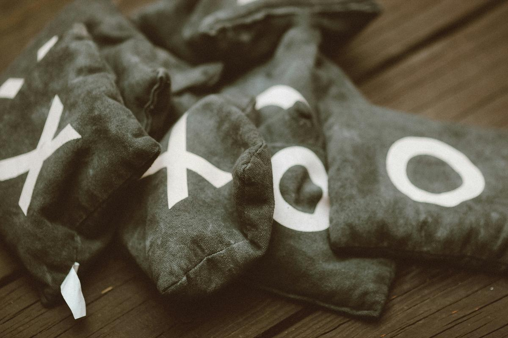

 
*Photo by <a href="https://unsplash.com/@jontyson?utm_source=unsplash&utm_medium=referral&utm_content=creditCopyText">Jon Tyson</a> on <a href="https://unsplash.com/photos/brown-and-white-textile-on-brown-wooden-table-eTjX8xc1in8?utm_source=unsplash&utm_medium=referral&utm_content=creditCopyText">Unsplash</a>*
    
看了電影《我的完美日常》後，就想到小時候玩圈圈叉叉的騙人把戲。

## 先手
所有具有先後手的益智遊戲，先手必定具有優勢，所以在圍棋中有貼目這個機制、卡牌遊戲《爐石戰記》裡的平衡法是後手多一費幸運幣，而西洋棋這種攻殺型的遊戲，在電腦引擎中會判定先手有大約+0.2~0.3的優勢（單位是一隻兵），這種類型遊戲的平衡性建立在賽局之外，例如雙方互相持先手與後手，所以持白的目標都會想要取勝，而持黑則是力求和棋，象棋也是同理。

圈圈叉叉這種遊戲也不例外，所以先手的目標就是想盡辦法取勝，而後手就要力求平手。講更白一點，因為這個遊戲規模太小，所以反過來講先手優勢就會太大，導致先手的話不可能輸，後手不可能贏的局面。

## 遊戲攻略

最容易騙人的先手下法就是：下在角落！

這樣的話，除非對手下在中間，不然其他位置都是必勝喔，試試看吧！這遊戲真的很簡單，玩過幾次之後應該就能學會了，趕快去騙騙你的朋友吧。

import React, { useState, useEffect } from 'react';

export const TicTacToeTrap = () => {
  // 生成初始盤面的函數，確保每次重置都是全新乾淨的陣列
  const getInitBoard = () => {
    const board = Array(9).fill(null);
    board[6] = 'O'; // O 固定在左下角 (index 6)
    return board;
  };

  const [board, setBoard] = useState(getInitBoard());
  const [turn, setTurn] = useState('X'); // 讀者扮演 X，後手
  const [status, setStatus] = useState('PLAYING'); // 狀態: PLAYING, DEFENDED, O_WON
  const [winLine, setWinLine] = useState([]);

  // 檢查是否有人獲勝
  const checkWinner = (squares) => {
    const lines = [
      [0, 1, 2], [3, 4, 5], [6, 7, 8],
      [0, 3, 6], [1, 4, 7], [2, 5, 8],
      [0, 4, 8], [2, 4, 6]
    ];
    for (let i = 0; i < lines.length; i++) {
      const [a, b, c] = lines[i];
      if (squares[a] && squares[a] === squares[b] && squares[a] === squares[c]) {
        return { winner: squares[a], line: lines[i] };
      }
    }
    return null;
  };

  // 尋找聽牌位置
  const findWinMove = (squares, player) => {
    const lines = [
      [0, 1, 2], [3, 4, 5], [6, 7, 8],
      [0, 3, 6], [1, 4, 7], [2, 5, 8],
      [0, 4, 8], [2, 4, 6]
    ];
    for (let i = 0; i < lines.length; i++) {
      const [a, b, c] = lines[i];
      if (squares[a] === player && squares[b] === player && squares[c] === null) return c;
      if (squares[a] === player && squares[c] === player && squares[b] === null) return b;
      if (squares[b] === player && squares[c] === player && squares[a] === null) return a;
    }
    return null;
  };

  // 陷阱 AI 核心邏輯 (以 O 的視角)
  const getNextMoveO = (currentBoard) => {
    const winMove = findWinMove(currentBoard, 'O');
    if (winMove !== null) return winMove;

    const blockMove = findWinMove(currentBoard, 'X');
    if (blockMove !== null) return blockMove;

    const oCount = currentBoard.filter(c => c === 'O').length;
    const firstXMove = currentBoard.indexOf('X');

    if (oCount === 1) { 
      if (firstXMove === 7 || firstXMove === 8) return 0; 
      return 8; 
    }
    
    if (oCount === 2) { 
      if (currentBoard[0] === 'O' && currentBoard[6] === 'O') {
        return 2; 
      }
      if (currentBoard[6] === 'O' && currentBoard[8] === 'O') {
        if (firstXMove === 0 || firstXMove === 3) return 2;
        return 0; 
      }
    }
    
    return currentBoard.findIndex(c => c === null);
  };

  // 系統 (O) 的自動回合
  useEffect(() => {
    if (turn === 'O' && status === 'PLAYING') {
      const timer = setTimeout(() => {
        const nextIndex = getNextMoveO(board);
        const newBoard = [...board];
        newBoard[nextIndex] = 'O';
        setBoard(newBoard);
        
        const winResult = checkWinner(newBoard);
        if (winResult) {
          setWinLine(winResult.line);
          setStatus('O_WON');
        } else {
          setTurn('X');
        }
      }, 500); // 保留延遲感
      return () => clearTimeout(timer);
    }
  }, [turn, board, status]);

  // 讀者 (X) 點擊事件
  const handleClick = (i) => {
    if (board[i] || turn !== 'X' || status !== 'PLAYING') return;

    const newBoard = [...board];
    newBoard[i] = 'X';
    setBoard(newBoard);

    // 判斷是否為第一步且下在正中間
    if (newBoard.filter(c => c === 'X').length === 1 && i === 4) {
      setStatus('DEFENDED');
      return;
    }

    setTurn('O');
  };

  const resetGame = () => {
    setBoard(getInitBoard());
    setTurn('X');
    setStatus('PLAYING');
    setWinLine([]); // 清空勝利連線
  };

  // UI 渲染樣式
  const getBorderStyle = (index) => {
    let style = {
      display: 'flex', justifyContent: 'center', alignItems: 'center',
      fontSize: 'clamp(2rem, 8vw, 3rem)', fontWeight: '600',
      cursor: status === 'PLAYING' && turn === 'X' && !board[index] ? 'pointer' : 'default',
      color: 'var(--ifm-font-color-base, inherit)',
      borderStyle: 'solid', borderColor: 'var(--ifm-color-emphasis-300, #888)',
      borderWidth: '0', aspectRatio: '1 / 1', padding: 0, fontFamily: 'system-ui, -apple-system, sans-serif',
      transition: 'background-color 0.3s',
      // 修正: 明確地做條件判斷，確保重置時 100% 變回透明
      backgroundColor: winLine.includes(index) ? 'var(--ifm-color-emphasis-200, rgba(128, 128, 128, 0.2))' : 'transparent',
    };

    if (index < 6) style.borderBottomWidth = '2px';
    if (index % 3 !== 2) style.borderRightWidth = '2px';
    if (index < 3) style.borderTopWidth = '2px';
    if (index % 3 === 0) style.borderLeftWidth = '2px';
    if (index % 3 === 2) style.borderRightWidth = '2px';
    if (index >= 6) style.borderBottomWidth = '2px';

    return style;
  };

  // 提示文字邏輯
  let message = "我先手下在角落了。換你隨意下！";
  if (status === 'DEFENDED') {
    message = "👏 破解成功！ 後手下在正中間是唯一的防守法。";
  } else if (status === 'O_WON') {
    message = "💥 落入陷阱啦，只要後手不下中間，先手就能保證獲勝。";
  }

  return (
    

      
      

        {message}
      

      

        {board.map((cell, i) => (
          <button key={i} onClick={() => handleClick(i)} style={getBorderStyle(i)} aria-label={`Cell ${i}`}>
            {cell}
          </button>
        ))}
      

      <button
        onClick={resetGame}
        style={{
          padding: '8px 20px', fontSize: '0.9rem', cursor: 'pointer',
          background: 'transparent',
          color: 'var(--ifm-font-color-base, inherit)',
          border: '1px solid var(--ifm-color-emphasis-300, #ccc)', borderRadius: '6px',
        }}
      >
        重新嘗試
      </button>
      
    

  );
};

<TicTacToeTrap />
