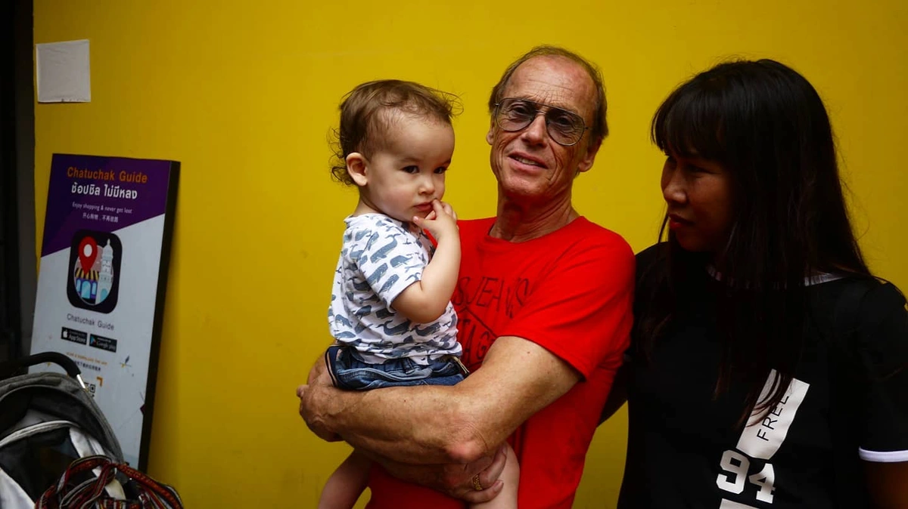
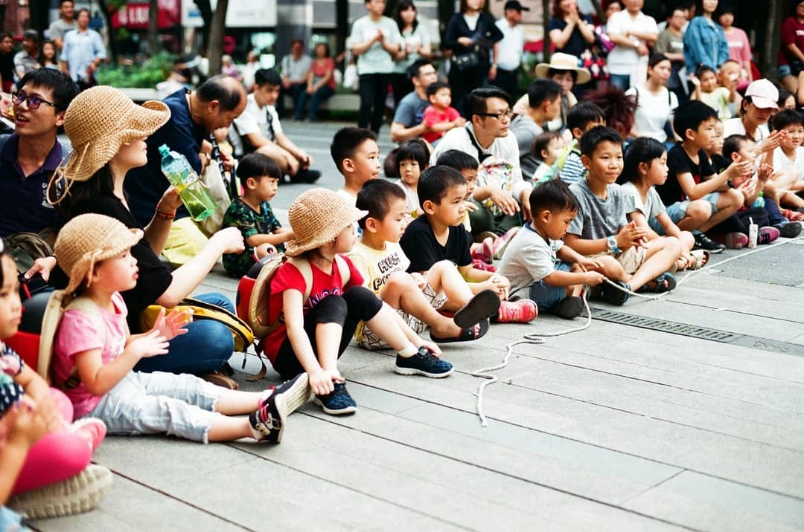
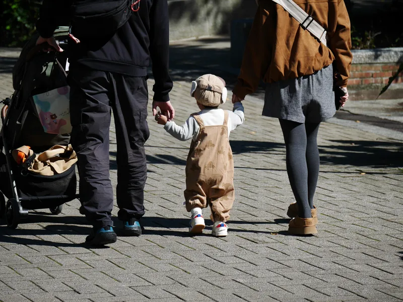
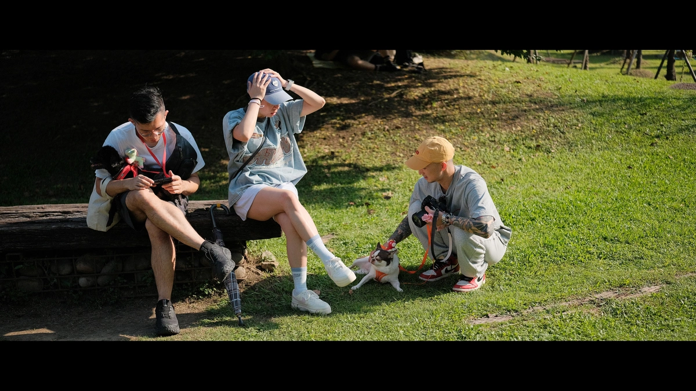
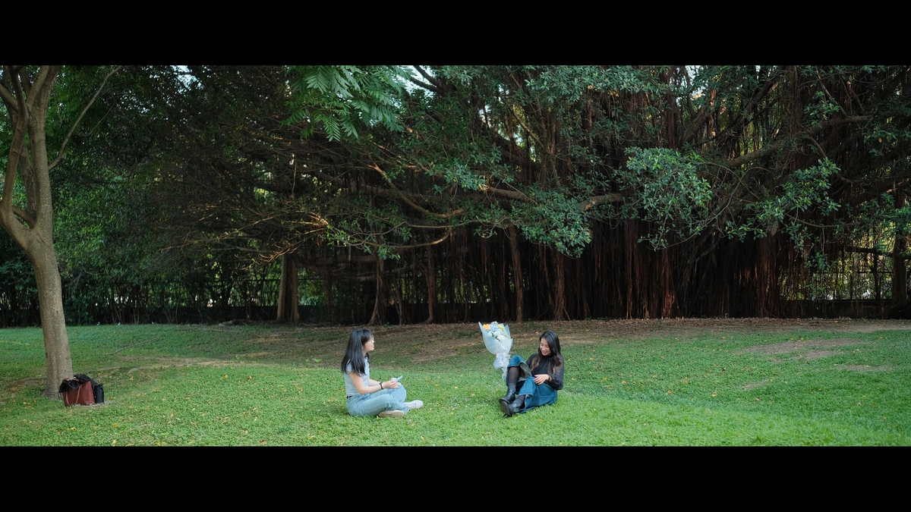
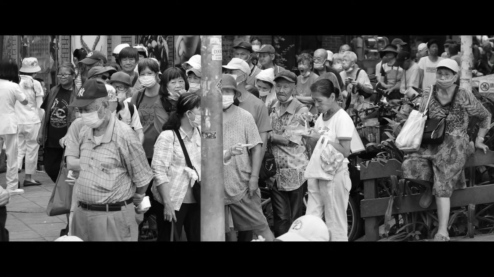
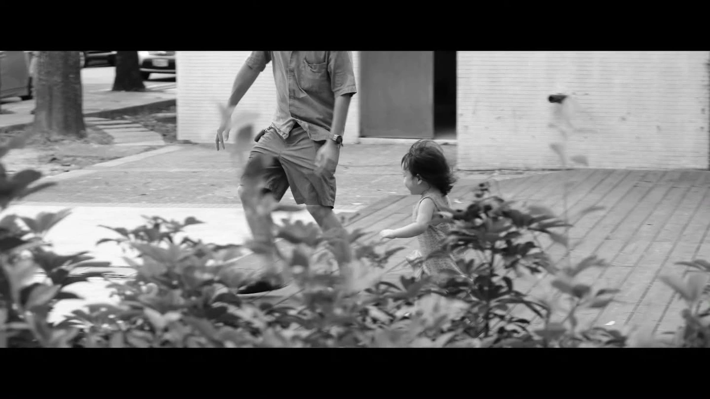
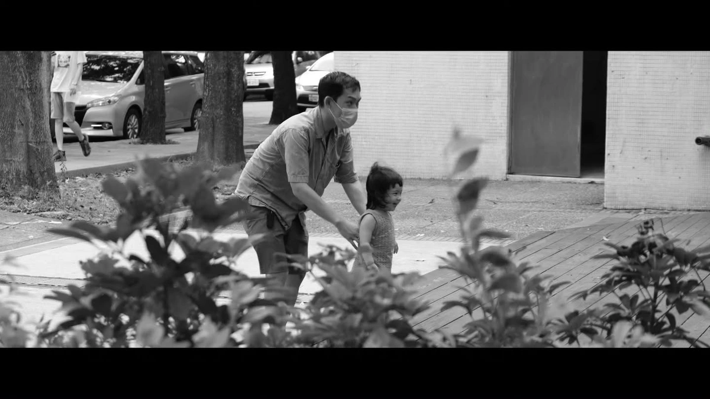
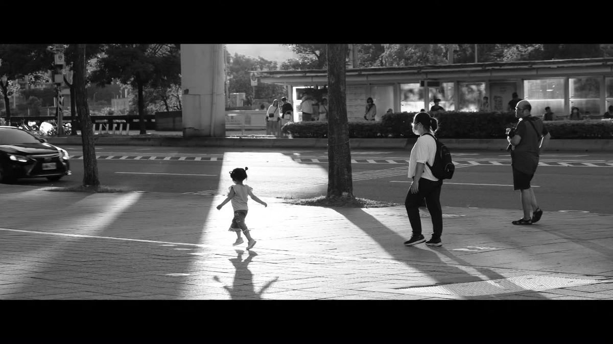

最近看到了好幾篇文章都有探討到街拍與隱私，例如小白的[〈關於街拍〉](https://itsxiaobai.github.io/blog/protrait/)和Eddie的[〈街拍與偷拍定義？社群媒體的人們都忽略了肖像權（我也是）〉](https://eddielv.com/musings/protrait-rights/)以及 LQ7 的[〈Actions speak louder than words〉](https://lq7.tw/thinking/actions-speak-louder-than-words/)，我仔細回想了一下，我自己好像從 2019 年開始拿相機東拍西拍到現在，從來沒有這樣子的想法。

我很喜歡拍街上的陌生人，置身在身處的環境中，捕捉到當下人們流露出最真實的神情，對我來說是很吸引人的一件事，親子一同玩耍的笑顏、朋友情侶的互動、孩子們對世界好奇的目光，將這些瞬間凝結下來，彷彿把全世界的歡樂都保留了起來。

## 拍攝的當下

也許是我拍的還不夠多不夠久，但是以我個人的經驗來說，直接大方的拿起相機拍，從來沒有遇到過有人不悅，或是要求我刪除的情況耶。其實只要展現的落落大方，我認為真的無所謂，如果有人表達不願意入鏡，我當然可以在他面前將照片刪除並道歉，不過通常只要點頭微笑，大家都是很善意的。

但很多時候，也許只是因為被攝者都沒發現我在拍攝就是了，如果是真的靠得很近，用 35mm 這種人文視角的鏡頭，可能那才是真正的街拍攝影，又是一個跟我想像不一樣的世界了吧。

我想直到有人義正辭嚴的寫信叫我把網站上的照片移除，或是當面叫我刪除照片之前，我還是會一直這樣拍下去的。

## 我的一些街拍作品

 

