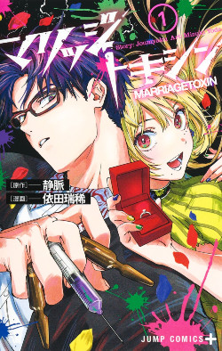
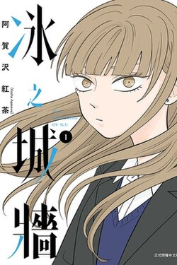
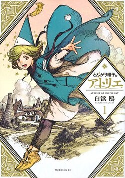
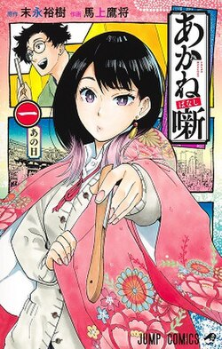
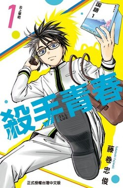
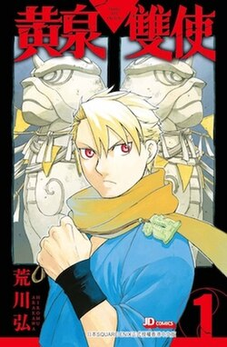

最近實在太多高品質的作品值得推薦，每一部都很喜歡，可以輪著追那麼多作品真的太開心了，忍不住來介紹一下。我個人比較喜歡不看故事大綱就直接去看作品，所以想知道內容大致上是關於什麼的話，可以進入標題連結的 Wiki 頁面看一下有沒有吸引到你！

## [婚姻劇毒](https://zh.wikipedia.org/zh-tw/%E5%A9%9A%E5%A7%BB%E5%8A%87%E6%AF%92)

 

榮登我最近的 TOP 1，我實在太喜歡這種正經王道設定，但主線卻是在做搞笑的事情這種作品了。反差的感覺真的好有趣，可以帥又可以鬧。第一集就能完整的理解世界觀和主線在做什麼，是個很輕鬆可愛的作品，一看馬上就停不下來了，是讓我有衝動想先去看漫畫的一部。

## [冰之城牆](https://zh.wikipedia.org/wiki/%E5%86%B0%E4%B9%8B%E5%9F%8E%E7%89%86)

 

這是一部校園作品，在講述關於內向 I 人的內心世界，甚至有點迴避型人格的狀態。作者把人與人之間情誼的刻畫，描繪得很細膩，很想慢慢挖開過去，一點一滴的深入這些角色的內心，喜歡這種題材的話，很值得一試。

## [魔法帽的工作室](https://zh.wikipedia.org/zh-tw/%E9%AD%94%E6%B3%95%E5%B8%BD%E7%9A%84%E5%B7%A5%E4%BD%9C%E5%AE%A4)

 

劇情挺王道的一部關於魔法世界的作品，最大的亮點是設定滿有新意，交代的比起其他魔法作品更為嚴謹，節奏稍慢了一點點，畫風很喜歡，角色都長的非常可愛呢。~~（五條老師你怎麼在這裡）~~

## [朱音落語](https://zh.wikipedia.org/wiki/%E6%9C%B1%E9%9F%B3%E8%90%BD%E8%AA%9E)

 

這部在講述一名少女立志成為「落語家」的故事。我很喜歡各種宣揚技藝的作品，像是《棋靈王》、《花牌情緣》等等，不只畫的很棒，看著這些角色為了夢想努力，追逐某些事物的時候散發出來的魅力，更讓人也不自覺的對這些不理解的事物充滿好奇與讚嘆。

## [殺手青春](https://zh.wikipedia.org/wiki/%E6%AE%BA%E6%89%8B%E9%9D%92%E6%98%A5)

 

一部徹底的搞笑番。設定有點老梗，但是非常流暢也好笑，角色很鮮明，可以放鬆無腦入手的一部作品。

## [黃泉使者](https://zh.wikipedia.org/wiki/%E9%BB%83%E6%B3%89%E4%BD%BF%E8%80%85)

 

《鋼之鍊金術師》作者荒川弘的新作，是這次介紹的作品裡最王道的一部戰鬥漫畫，故事是先發展，再慢慢補齊究竟發生什麼事的類型，戰鬥很帥也很過癮，喜歡少年漫畫的話不要錯過！
