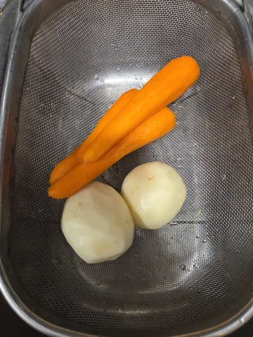
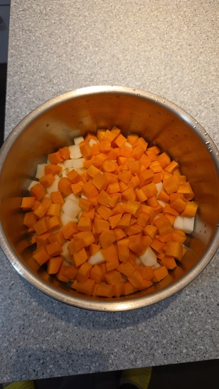
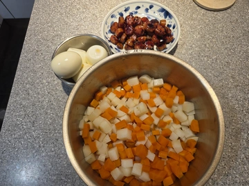
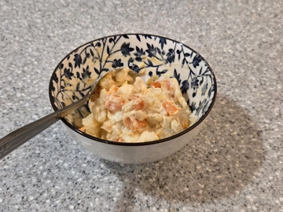

下雨天就想在家弄一點小東西吃，今天分享一個從小吃到大的蛋沙拉食譜（直接偷我媽的秘方）。

## 材料

非常簡單，紅蘿蔔、馬鈴薯、台式香腸、水煮蛋、沙拉醬。

## 步驟

1. 紅蘿蔔、馬鈴薯削皮處理好。

 

2. 接著切丁進電鍋，內鍋不放水，外鍋兩杯水，這樣煮好會超級甜，比水煮好很多，也不用顧。

 

3. 煎香腸[^1]，我們家都用滿漢的蒜味香腸。順便處理水煮蛋，水滾下蛋煮熟撥好殼備用。

<video 
  autoPlay 
  loop 
  muted 
  playsInline 
  width="360"
>
  <source src="/video/018.mp4" type="video/mp4" />
  抱歉，您的瀏覽器不支援內嵌影片。
</video>

4. 輕輕鬆鬆就備好全部的料啦！

 

5. 成品！可以熱熱吃，但我個人更喜歡放涼或是冷藏後食用。

我從小的吃法是拌入桂冠沙拉醬（俗稱美奶滋），雖然不健康但真的好好吃，除了蔬菜的鮮甜，還有混合進香腸的油脂，搭配上美奶滋的甜味，太美味了，這就是童年的味道。

 

[^1]:感謝 Eddie 的文章[〈在網站上放動圖的方式〉](https://eddielv.com/articles/motion-images/)讓我學會無聲循環動畫影片。
