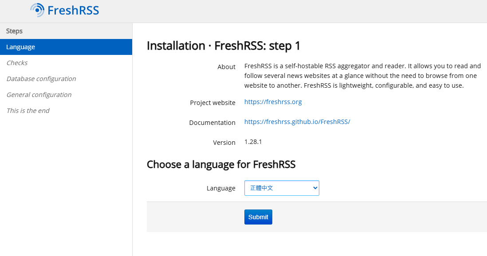

## 自架 RSS 服務

最近我對 RSS 閱讀器 inoreader 的速度不是很滿意，每次文章都會比手機上用 Feeder 晚很多才出現，但是我又很想要各裝置間都能同步的功能，不然統整所有的訂閱會很麻煩。雖然在 inoreader 上花錢訂閱就做得到這件事，但是我一直都很想嘗試看看虛擬專用伺服器（Virtual Private Server），所以心血來潮就申請免費的甲骨文雲(Oracle Cloud)試玩看看，免費的主機也足夠部署自己的自架 FreshRSS 了，就當做「練手」的入門專案。

## 成果

照著 AI 的指示[^1]，大概一丶兩個小時就成功了，申請完主機後，用`ssh`連上自己的主機，設置好 docker 架好 FreshRSS，再把 RSS 名單匯入進去就可以無痛轉移來使用拉！

 

我現在的 Android 手機上選擇使用 Feedflow，登入 FreshRSS 的帳號密碼就同步了，很方便，介面我也滿喜歡的，乾淨清爽。至於在電腦的瀏覽器上，直接連上 FreshRSS 使用就可以了。

最近這陣子有想要自己組 NAS 存放資料的念頭，還可以順便把 FreshRSS 架在 NAS 上了，不過現在硬碟價格真的好離譜呀，過一陣子回穩了再說吧。

[^1]:過程就不贅述了，細節有一點點繁瑣，但是不會太困難

