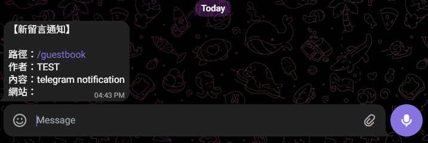

最近在[廢文小天地](https://trashposts.com/about)的`/about`頁面看到一個子網站[「Today I Learnd」](https://til.trashposts.com/)，有好多實用的筆記，大推。

最近很多人響應的「部落格問題挑戰」裡，廢文小天地整理了[很多人寫的文章](https://trashposts.com/blog/blog-questions-challenge/)。我自己寫的那篇沒有把所有人的文章連結放上去，第一個原因是廢文小天地大大已經有放過了，第二個原因是我懶 ~~（這是主因吧！）~~ 看到這個網站才知道，原來有一個很聰明的流程耶，不是全部都手動加的，歡迎大家去看[他的做法](https://til.trashposts.com/blog/collect-blog-rss-url-list)。

## 如何使用 Telegram 傳送通知給自己

在筆記裡面，其中這篇[〈如何使用 Telegram 傳送通知給自己〉](https://til.trashposts.com/notes/tutorial/telegram-notify)是我最有興趣的，於是我馬上就來實作在我的留言板系統裡面了。

真的很簡單又很方便！以後有留言就可以馬上從手機上接到提醒了！實測有效，真的很喜歡這個功能，感謝大大的筆記幫助了我。

 

## 寄信還是貼文

最近看了 Jaron 的這篇[〈我喜歡寫 E-mail 而不是留言〉](https://www.jaron.tw/blog/i-like-email/)後，我有個想法是，既然要寫信去跟喜歡的格友聊天或是表達喜愛，那何不直接發一篇文章在自己的頁面上就好了（前題是內容沒有什麼私密性的話）。也許有人也會想要看吧，我認為把自己的喜歡推廣出去也很好阿，不用只讓作者一個人知道，這樣才能讓大家也有機會一起喜歡，畢竟：

>世界還缺少你寫的內容！
>
> —— Timo[〈世界缺少你寫的內容〉](https://timoblog.com/post/missing-your-content/)

於是像這篇原本應該寄給廢文小天地的 mail，就直接被我寫在這裡了。

