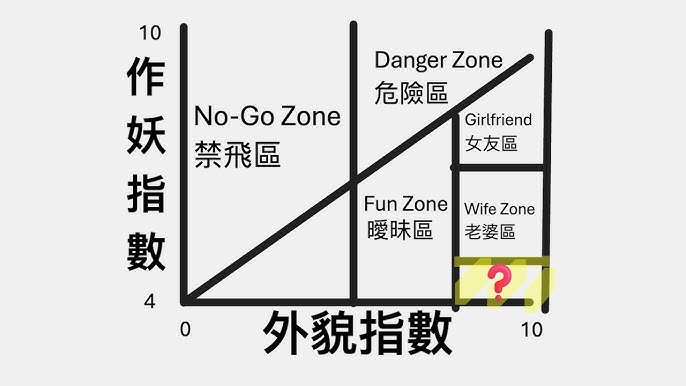

昨天蝦波傳這個影片給我看跟我討論：[《選女友，其實是一道數學題｜Hot Crazy Matrix》](https://www.youtube.com/watch?v=Ow2DLTYhIs4&t=6s)，真的把我笑死了，一定要來筆記一下重點整理。（她很驕傲的說她覺得自己是 Unicorn）

 

## 座標系定義

### X 軸：外貌指數 (0 - 10)
這裡的審美取決於個人相對感受。所謂的「10 分」不一定要是安海瑟薇，通常在男生眼裡的班花等級，就已經是頂標了。

### Y 軸：作妖指數 (4 - 10)
為什麼從 4 分開始？因為這世界上**沒有任何女生的作妖指數低於 4 分**（快被這個天才定義笑死）。在一段長期的關係中，女生一定會有不講理的時候，這是男生進入戀愛前必須明白的前題。

## 領空劃分

### 🚫 禁飛區 (No-Go Zone)：顏值 < 5
**永遠不要與顏值低於 5 分的女生產生情感交集。**

這不僅是為了你的情緒投資，也是對人家的公平，只因為寂寞而隨便示好，這樣對雙方都是傷害，根據每個人標準不同，可能你的 5 分是別人的 10 分。

真沒想到看個搞笑影片，讓我有醍醐灌頂的感覺。

### ⚠️ 危險區 (Danger Zone)：顏值 5 - 10，作妖線以上
這裡的女生「作」的程度已經會對身心或財產造成傷害，但是外貌又讓你勉強接受這一切。
*   **特徵：** 剛認識就瘋狂要求物質表示、吵架時會扔東西或拉方向盤。
*   **忠告：** 如果你沒有過人的心理素質或口袋，千萬別輕易挑戰。

### 📊 曖昧區 (Fun Zone)：顏值 6 - 8，作妖線以下
這是大多數人所在的區域。根據影片的理論，這是一個「動態模型」，女生的狀態會隨著打扮、健身或心情而上下移動。建議透過長期觀察（數據點簇）來判斷她的平均值。

### 🙎‍♀️ 女友區 (Girlfriend)：顏值 > 8，作妖線以下
*   **特徵：** 可能把星座當成客觀真理，或是嘴上說要減肥，零食手搖卻還是照吃不誤等等，但大多數情況下無傷大雅，瑕不掩瑜。

### 💍 老婆區 (Wife Zone)：顏值 > 8，作妖指數約 5 - 7
**這是所有男人的終極目標。**
*   **特徵：** 長得好看，且具備理性溝通的能力，又是一個「好裁判」。
*   **好裁判標準：** 規則是對等的。如果她要求你不能大聲，她自己也會做到。
*   **遇見了怎麼辦？** 趕快帶回家見父母，不要等什麼事業有成，良人先成家。

---

## 神祕的「獨角獸」 (Unicorn Zone)

**顏值 > 8，作妖 < 5。**

這種長得像仙女，卻完全不「作」、甚至比你還講道理的對象存在嗎？

**結論是：不存在。**

如果你在網路上遇到一個完全符合獨角獸特徵的人，聊起來如沐春風、完全沒有摩擦，請保持警覺。根據大數據分析，螢幕另一頭多半是個準備要「嘎你腰子」的摳腳大漢。

## 給男生的心態建議

很多男生遇到「老婆區」的女生會因為自卑而不敢行動。

咻弗森提到，強如柯瑞（Stephen Curry）也會有九投零中的時候，但他絕對不會不敢投第十球。在感情世界裡，**如果你連出手都不敢，命中率永遠是零。**

---

## 結論

看到留言想起來，我在美劇 How I Met Your Mother 裡面，也聽過 Barney 提出過 Hot/Crazy Scale，真的是超好笑的，相對來說，男生也有一個在女生心中的 Hot Crazy Matrix 吧，可能判斷的指標不同，但其實道理都是相同的。

對了，我也覺得**蝦波真的是百年難得一見的奇跡 Unicorn 喔！**（發自內心，生命沒有遭受威脅）

