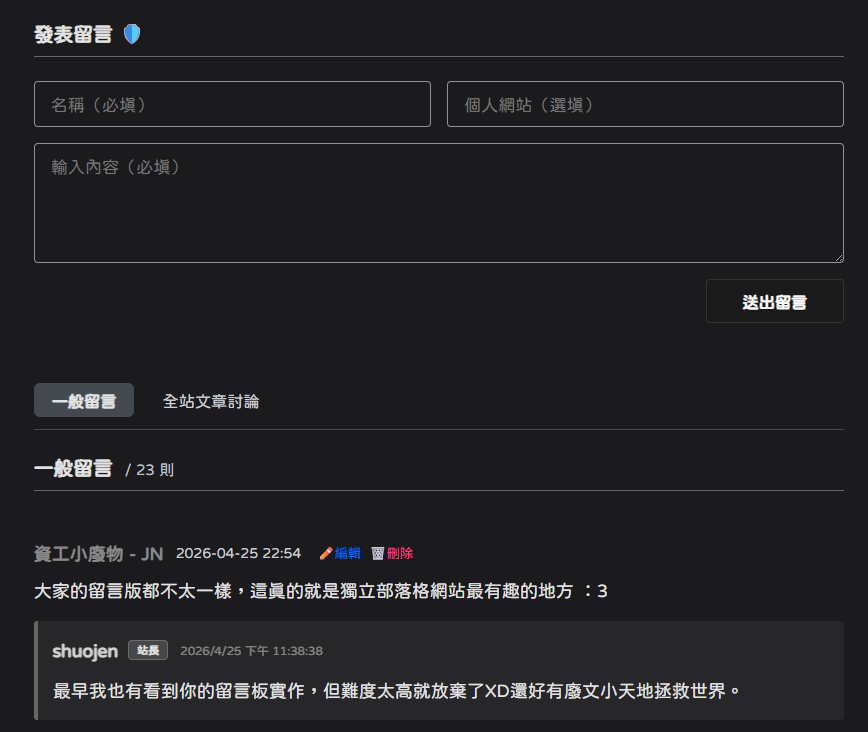

昨天在 Leaf 的新文章[〈Nebula探索系統？〉](https://www.leaftechblog.cloudns.biz/posts/2026_05_07_1/)的留言板留言，馬上就被那個留言速度驚豔到了，後來逛到了[〈第二個留言區測試〉](https://www.leaftechblog.cloudns.biz/posts/2026_04_24_3/)這篇文章，看到 Leaf 跟皮皮的討論如獲至寶，馬上就如火如荼來進行改版了，這裡感謝 Leaf 和皮皮的啟發。

題外話，Leaf 的[網站](https://www.leaftechblog.cloudns.biz/)滿好看的，我最喜歡逆向系列，資安方面的實作對我這種程式麻瓜來說真的很有意思。

## 為什麼要改版？

明明我一直在文章還有留言區宣傳這個自建留言板的方案，為什麼又要來改版呢？雖然真的已經足夠好用了，但還是有兩點我覺得可以雞蛋裡挑骨頭的地方。

### 1.速度稍慢了一點

因為我使用的 Google Apps Script (GAS) 有「冷啟動」延遲的問題，每次送出留言通常要等五秒左右（我自己的體感）如果使用 Cloudflare Workers 的話，由於在全球都有伺服器節點，程式碼會直接在離讀者最近的那個節點執行，就沒有冷啟動問題，再搭配原生的 D1 資料庫，留言的速度自然快上非常多。

:::note[感謝皮皮來信，幫補充一些小觀念]
>冷啟動主要是環境啟動時間，節點比較偏網路延遲（通常很短，可以忽略），概念上不太一樣。不精準的比喻：Worker 比較像是電腦休眠喚醒，GAS 比較像是電腦重開機，所以啟動時間才會差那麼多。
:::

### 2.需要搭配 Google Sheet 使用

雖然很簡易，也沒有什麼使用上的問題，但是我想盡量避免使用 Google 的服務（找逃生路線！），再來就是自從我加入 [Telegram 留言版通知系統](/blog/2026/04/30/telegram)後，都能秒收到留言通知，但是在 Sheet 上用手機回留言實在不太方便，我要在小小的視窗內回覆完，再切到電腦版顯示，然後執行同步到 Gist 的程式（超難點），所以我的解法是：寫一個**隱藏的管理介面**（詳後文）。

## 改版架構說明

使用 Cloudflare Workers（取代原本的 GAS） 搭配 Cloudflare D1（取代原本的 Sheet）

- 原始留言板：Docusaurus ➔ GAS ➔ Sheet ➔ 轉 JSON ➔ 存入 Gist ➔ Docusaurus 讀取

- 新留言板：Docusaurus ➔ Cloudflare Worker ➔ D1 資料庫 ➔ Docusaurus 讀取

使用 Cloudflare Workers+D1 能夠保持原本留言板的優點：無伺服器丶不需登入丶介面乾淨，並且加上速度變快，比之前的留言板速度大約快了一倍（之前的速度我偶爾測試的時候會懷疑有沒有當機）。

:::note[感謝皮皮來信，幫補充一些小觀念]
>現在好像是維持載入全部的留言，其實可以根據該頁面帶入 slug 抓出對應的留言就好。這樣就沒有留言膨脹的問題了，查詢速度也會加快。未來如果全站留言真的太多，也可以考慮分段動態載入。不過現在的留言還不多，載入全部也是沒問題的。
:::

## 操作流程概述

這個部份的細節不過多贅述了，其實不會太困難，因為每個人的框架不太相同，我認為記錄操作細節意義不是很大，相信使用 AI，稍微除錯一下就能成功了。

1. 建立 D1 資料庫與資料表（在 Cloudflare 準備好裝留言的「新倉庫」）

1. 建立與部署 Worker 後端程式（寫好 API，並加上專屬的「管理員金鑰」驗證）

1. 綁定 Worker 與 D1（讓 API 有權限讀寫那個資料庫）

1. 修改前端 index.js（換上新網址，並把隱藏的「管理員刪除/回覆按鈕」加進去）

1. 搬移舊留言（把舊的 Sheet/Gist 資料輸出再匯入新資料庫）

:::note[感謝皮皮來信，幫補充一些小觀念]
>不確定刪除功能是不是軟刪除？也就是只做狀態更新 (如 is_deleted=1)，軟刪除會更安全一點，避免自己誤刪或是金鑰外洩的時候被別人刪光光。
:::

## 我最愛的新功能

現在的留言板可以在前端顯示並進行回覆，實在太讚了！

只要設定一個「管理員金鑰 (Admin Key)」，當程式偵測到瀏覽器存有正確金鑰時，就會在留言下方顯示「刪除」和「編輯回覆」的按鈕。

最有趣的是，現在網站內有一個像是彩蛋的 **「隱藏入口」**，只要執行隱藏的動作，並輸入我設定好的金鑰，React 就會額外渲染出管理者模式。

 
▲像這樣出現有盾牌型式的管理者模式！超級有趣！

## 找找彩蛋

歡迎去[留言板](/guestbook)找找看彩蛋在哪裡吧，靠自己找到的話來找我拿小禮物：一個👍。

import Details from '@theme/Details';

進入[留言板](/guestbook)找到標題的 「發表留言」 這四個字，對著它連續點擊 5 下試試吧！

