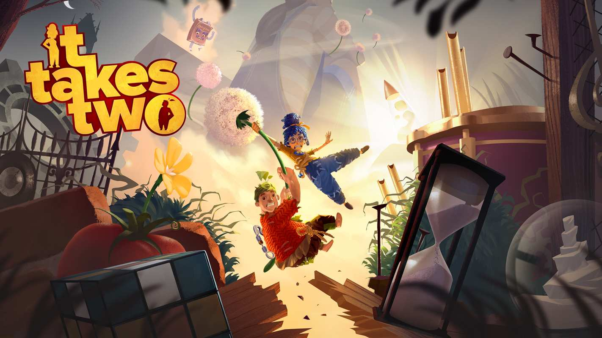

之前跟蝦波一起玩[《REANIMAL》](/blog/2026/03/07/reanimal)，就愛上這種兩人同機破關的遊戲，最近我們趁特價買了[《雙人成行》](https://store.steampowered.com/app/1426210/_/)，五年前的作品了，一直聽說是個神作，現在終於買來玩了，今天通關完的心得是：超好玩！

## 推薦理由

1. 關卡設計非常具有創意與巧思，一起合作解謎的部份都讓人很驚喜，不會到太困難，卡關基本上不會超過十分鐘還想不到。
2. 劇情來說，我覺得普通，算中規中矩而已，但是畫面很美，場景很用心，會很開心欣賞的程度。
3. BOSS 很可愛，像是家裡會出現的吸塵器、工具箱、猩猩玩偶，不嚴肅富有童趣的風格我很喜歡。
4. 可以在地圖上尋找很多隱藏的小遊戲可以跟隊友一起競爭，甚至還有完整的西洋棋！（我毫不留情的把蝦波將殺）

  

## 注意事項

1. 如果對遊戲完全沒概念的話，可能稍微需要熟悉一下操作，需要轉動視角跟跳來跳去，但不會像魂類遊戲那樣逼人，無限復活沒什麼壓力。
2. 解謎需要兩人高度合作，尊重友善包容，才不會吵架（也不錯，玩遊戲就可以測試伴侶是不是好隊友）
3. 打架的時候，只要一個人不死就可以一直繼續下去，存檔點也都離死的進度很近，不用太擔心。

## 後記

我們大概十小時就全部通關了，真的體驗非常好，每天下班回家都迫不及待跟蝦波一起打開遊戲來玩，我們的目標已經鎖定同個公司的新作[《雙影奇境》](https://store.steampowered.com/app/2001120/_/)了，評價也很好，真的好期待呀！
