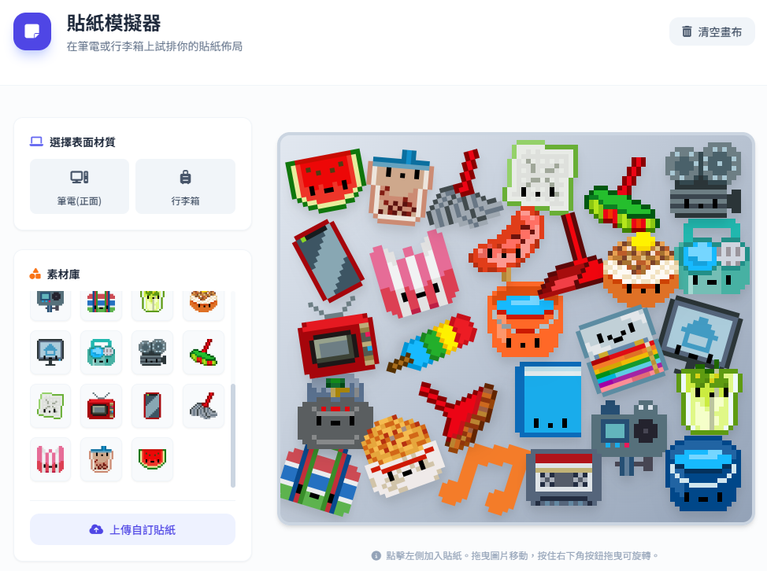

最近 [Shuyu](https://shuyulin1127.com/) 大大的[ Icon 圖庫](https://icons.shuyuart.com/)上線了[^1]，等待好久果然沒有失望，超級可愛的！

昨天睡前突然想到一個點子，如果這些可愛的像素小圖是一張張貼紙的話，貼滿筆電或是行李箱不知道長什麼樣子？好像會很可愛耶，於是我生成了一個「貼紙模擬器」小工具，這樣就可以模擬看看貼滿貼紙的風格好不好看。

## 成果

成品我覺得很可愛耶！滿好玩的，連結在這裡：[貼紙模擬器](https://shuojen.com/sticker)，也可以用自己的圖片玩看看喲。

[^1]:可以參考 shuyu 大大的[架站心得](https://shuyulin1127.com/deploying-hugo-with-cloudflare-pages/)
