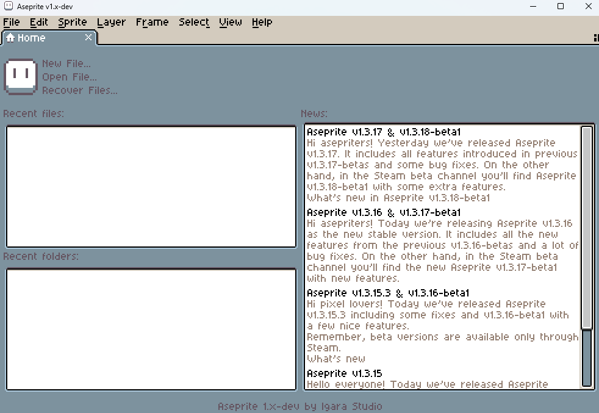

▲用五秒畫一張小像素圖來慶祝成功免費獲得 Aseprite！

## 前言

由於太喜歡 Shuyu 的作品，在看到[〈LibreSprite 一週使用心得，以及我沒有繼續使用它的原因〉](https://shuyulin1127.com/libresprite-review-and-why-i-quit/)之後，就萌生了使用看看 Aseprite 這個神級像素軟體的想法！雖然也想過先用 LibreSprite 就好了，但還是覺得一步到位最省力！

想要省時省力的話，可以在 [Aseprite 的網站](https://www.aseprite.org/)以 19.99 美元購入這個軟體，雖然真的已經非常佛心了，但因為 Aseprite 專案本身開源，所以其實可以使用自行編譯的版本。

在官方的說明中提到：

>Aseprite started being open source since its very beginning in 2001, and we were happy with that until August 2016. Now you can still download its source code, compile it, and use it for your personal purposes. You can make commercial art/assets with it too. The only restriction in Aseprite EULA is that you cannot redistribute Aseprite to third parties.
>
>*(Aseprite 自 2001 年面世以來便是開源的，我們一直對此感到很滿意，直到 2016 年 8 月。現在，你依然可以下載它的原始碼、自行編譯，並將其用於個人用途。你也可以用它來創作商業藝術作品或資產。Aseprite EULA（最終用戶授權協議）中唯一的限制，就是你不能將 Aseprite 重新分發給第三方。)*

## 如何達成自動編譯

### 超．級．簡．單！

1. 首先我們先下載 [Google antigravity](https://antigravity.google/) 並登入帳號，這是一個可以自行操作電腦的 AI agent，完全不需動手就能成功完成編譯。

2. 我們創建一個全新的資料夾命名為 `Aseprite` 並將其做為一個新專案，輸入以下對話：

```
請幫我在 Windows 系統下編譯 Aseprite。目前尚未安裝任何開發與編譯工具。
你需要：
1. 下載並安裝編譯所需的 C++ 開發環境，包含 Git、CMake、Ninja，以及 Visual Studio 2022 的 C++ 桌面開發工作負載 (MSVC)。
2. 複製 Aseprite 的官方 GitHub 原始碼（包含子模組）。
3. 下載並配置相容的 Skia 預編譯繪圖庫。
4. 呼叫編譯器，在 `build` 資料夾中完成 CMake 設定並以 Ninja 執行編譯，最終在 `build/bin/` 目錄下產生可執行的 `aseprite.exe`。
```

## AI Agent 的自動執行過程

送出對話後，Antigravity 便開啟了自動化操作流程：

**環境偵測與安裝**（自動安裝 VS 2022、MSVC、Git、CMake、Ninja）➔ **資源下載**（複製 Aseprite 與下載 Skia 庫）➔ **設定與編譯**（背景執行 CMake 與 Ninja 編譯）➔ **整理交付**（輸出 `aseprite.exe` 至 `build/bin` 目錄）

每個步驟都可以確認後再允許 AI 執行，有任何問題隨時都能提出來調整。這種完全不需要自己動手的體驗，難道就是當老闆的感覺嗎 ლ(́◕◞౪◟◕‵ლ)！

最終編譯好的軟體就在 `aseprite\build\bin` 這個路徑裡，執行 `aseprite.exe` 就大功告成啦。




## 後記

因為剛好看到 Kevin 的[〈我想做出怎樣的網站〉](https://kevinowo.com/blog/website-redesign)，文章中提到 [LQ7](https://lq7.tw/) 大大推薦過這個工具，這就是我找了好久的東西耶！不用另外使用 API 的 AI 工具，真是太好了，馬上想到第一件專案可以做這個編譯工作，結果超級順利的完成了真是可喜可賀。

現在，我可以開心地用我自己編譯的 Aseprite 畫像素畫了[^1]！

[^1]:其實這個人根本沒在認真畫...

