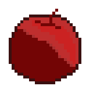

今天學習了幾個 Aseprite 的快捷鍵跟功能。

## 快捷鍵

- 鉛筆工具 (B)
- 選取工具 (M)
- 橡皮擦工具 (E)
- 滴管工具 (I)
- 油漆桶工具 (G)
- 重新調整畫布大小 (C)

## 功能

- Pixel-perfect - 可以自動讓線條更俐落。
- Horizontal Symmetry - 可以鏡像畫出線條。
- Edit -> FX -> Outline 可以快速上外框。

## 小技巧

- 使用選取工具後按住 <kbd>ctrl</kbd> 拖曳可以直接拉伸
- 在顏色深淺的交界處可以用兩者中間的顏色，達到一種抗鋸齒的效果。

Aseprite 真的很好用耶，相見恨晚！好玩。
