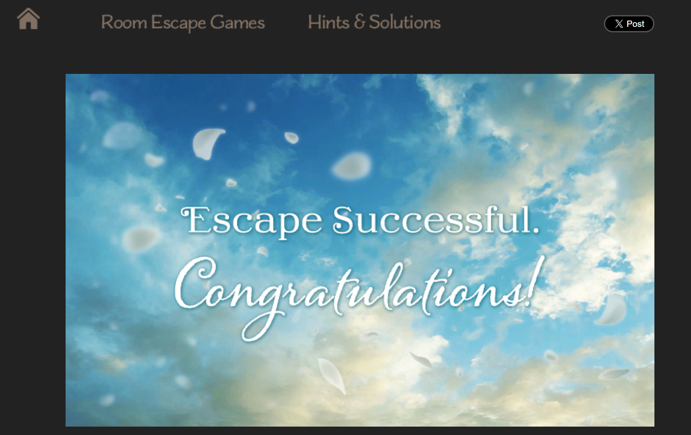

感謝 LQ7 推薦[〈Neutral Room Escape Games〉](https://lq7.tw/mood/neutral-room-escape-games/)，先附上[遊戲連結](https://neutralxe.net/room/level/)，我玩的是難度較高的《LEVEL》！他在文章中提到：

>這篇文章特地挑在禮拜五發[^1]，如果對密室逃脫「小品」有興趣的朋友，強烈建議周末將一小段時間留給 Neutral。雖說是小品，我認為至少會花大概三小時以上（如果完全不看提示的話）

## 遊玩心得

LQ7 的強力推薦讓我非常感興趣，馬上乖乖把下午的時間留給這個遊戲，結果真是太抬舉我了，我看了提示大概十次還是花了三小時（哭哭），真的不看的話沒辦法繼續玩下去，對密室逃脫沒什麼概念的菜鳥，果然一上來就被震撼教育了。

我以前只跟大隊長玩過鏽湖的 The Past Within，當時體驗非常不錯，而這個遊戲的精彩程度完全不輸這個作品，難度高很多倒是真的，解出來的成就感也高非常多，我最喜歡《LEVEL》裡的塗鴉跟滾球，作者的巧思真的好令人驚嘆！非常推薦大家也來玩看看。不說了，我要去玩難度低一點的《SIGN》了，希望這次可以完全不看題示通關。

## 後記

玩到拿出紙筆的不知道是不是只有我XD，通關後，我興沖沖的跑去看最後一個謎題的解答思路，發現我根本少拿一張紙！但竟然還是不影響答案的解出來了，真是有趣。

[^1]:雖然禮拜四就看到這篇文章(?)