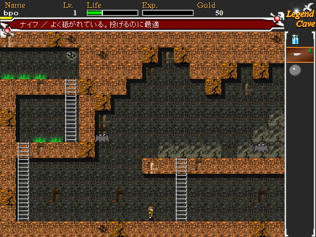
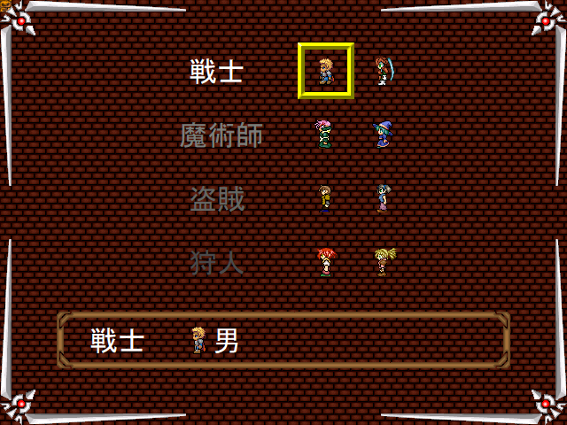

看到 Wiwi 的[〈我的遊戲音樂記憶 ✦BBP6✦〉](https://wiwi.blog/blog/game-music-memories)，讓我想起一個我的童年的遊戲，上網發現在[ ptt ](https://www.ptt.cc/bbs/Little-Games/M.1461819549.A.152.html)還找的到載點，這應該是我小時候最愛重複玩的一個遊戲了，每個職業都全破過。

▲遊戲畫面

▲職業選擇

我喜歡盜賊 = 狩人 > 戰士 > 魔術師

* 盜賊在骨頭裡會拿到比較多錢，可以在商店買東西，飛刀和鐵球傷害也比較高
* 狩人弓箭很痛，還有一種高級弓可以穿透
* 戰士普攻和盾牌防禦比較強，其實沒啥用
* 魔術師用魔法書比較強一點

## 遊戲功略

基本上就是在各個區域探索，在藍區和綠區拿到兩種花的道具之後，走到紅區最深處跟 BOSS 單挑就結束了。

有一些很有趣的設定，像是老鼠會偷你身上的東西，要去找一個貓的道具才能防老鼠，還有小時候意外拿到一個稀有道具叫「波斯的輪腕」很厲害，可以無限射出劍氣，但我只看過一兩次而已。

遊戲的音樂也滿好聽的，玩這麼多次已經達到洗腦的程度了，小時候的遊戲樸實無華，但是卻可以玩的很開心，真的有點懷念，能體會 LQ7 玩到[ ELEMENTS ](https://lq7.tw/mood/neutral-room-escape-games-elements/)有多感動了。

## 後記

突然又想起了[小小 CS ](https://www.youtube.com/watch?v=OLtCqI4PgAU&t=2s)這個懷舊小遊戲（原來啾啾鞋介紹過），還有蝦波跟我說《魔女之家》也很好玩，我也想玩看看，下次再來介紹吧。
