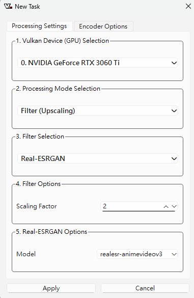

看完 Ivon 的[〈Linux版Anime4K使用教學，一鍵提昇動畫畫質〉](https://ivonblog.com/posts/anime4k-linux/)後，讓我想修復之前用 yt-dlp 載下來的動漫，先看看效果！

  
  

（在大螢幕上或者放大來看更明顯）

## Video2x 操作

我使用的工具是開源免費的[ Video2x ](https://github.com/k4yt3x/video2x)，使用非常簡單，影片丟進去並選幾個選項，慢慢等它跑完就完成了。

1. Vulkan Device Selection

    選擇自己的顯卡，基本上沒什麼好選的，有好顯卡的話，恭喜你！

2. Processing Mode Selection

    `Filter(Upscaling)` 是讓影片變清晰，而 `Frame Interpolation` 是讓影片畫面變流暢（補幀）

3. Filter Selection

    我選擇用 `Real-ESRGAN` 這個演算法，吃顯示卡效能，處理速度最慢，但效果很好，其他的我還沒試過。

4. Filter Options

    這裡如果原片是 480p 畫質就選 4 倍、 720p 畫質就選 3 倍、 1080p 畫質就選 2 倍，這樣轉完就都會是 4k 畫質了，但 480p 的話，由於原片細節太少，我覺得選 2 倍到 1080p 就好了。

5. Real-ESRGAN Options

    真人電影選 `realesrgan-plus`、動漫選 `realesr-animevideov3`，年代很久遠需要強力修復的話，也許可以試試看 `realesrgan-plus-anime`。

雖然跑了滿久的，但最後的效果很滿意，快去試試看吧。

