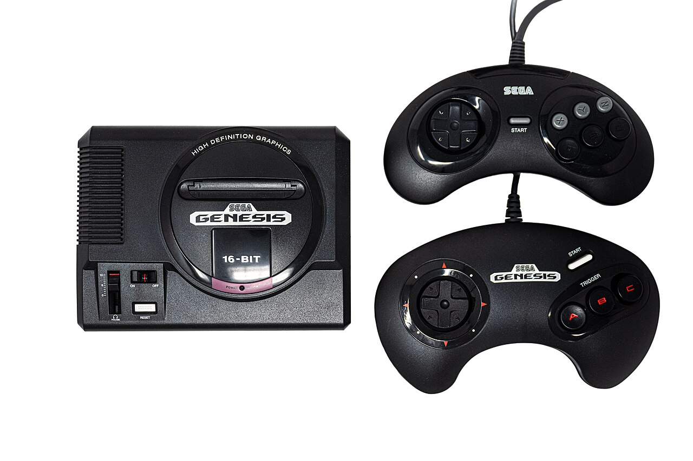
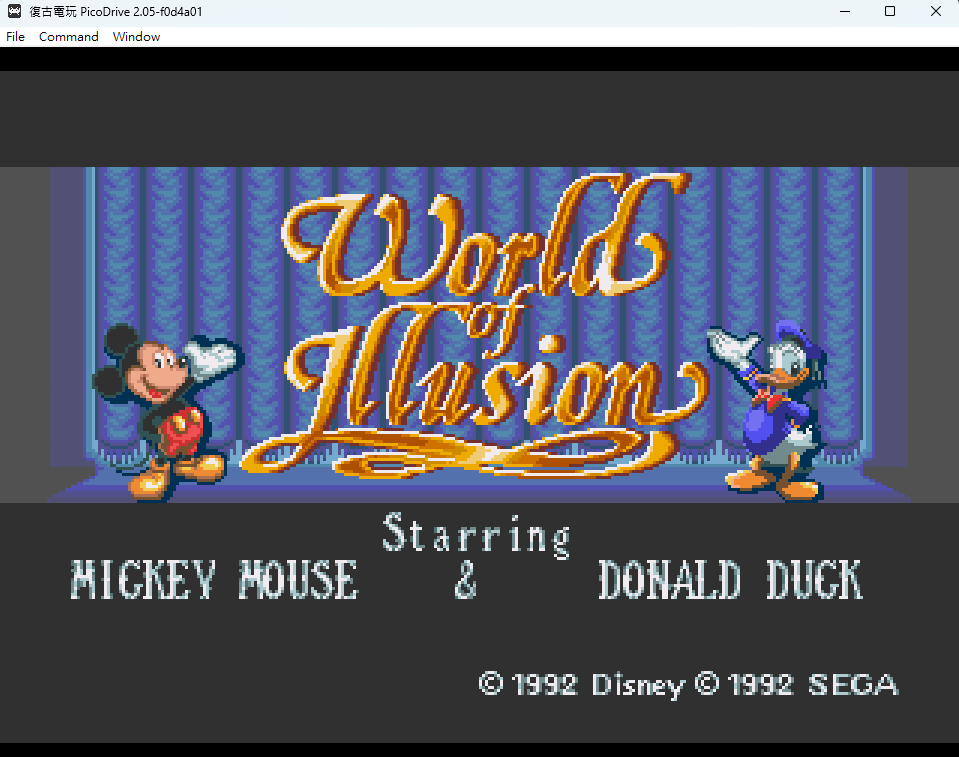

昨天蝦波跟我說，她小時候會跟表姐玩一個主機遊戲，是米老鼠跟唐老鴨一起冒險的遊戲，可是後來大人不給她們玩了，所以最後面幾關沒破完。

根據她的描述我找了一下，應該是 Sega 主機上的[《World of Illusion Starring Mickey Mouse and Donald Duck》](https://en.wikipedia.org/wiki/World_of_Illusion)這個遊戲。

▲蝦波看了我找的圖片說應該就是這個要插卡的主機

剛剛好前幾天看到 Wiwi 在[〈荒島筆電〉](https://wiwi.blog/blog/desert-island-laptop#-%E8%BB%9F%E9%AB%94%E9%A1%9E)介紹到[ RetroArch ](https://www.retroarch.com/)，可以馬上準備給她玩實在好幸運，連假可以一起來玩老遊戲了！

