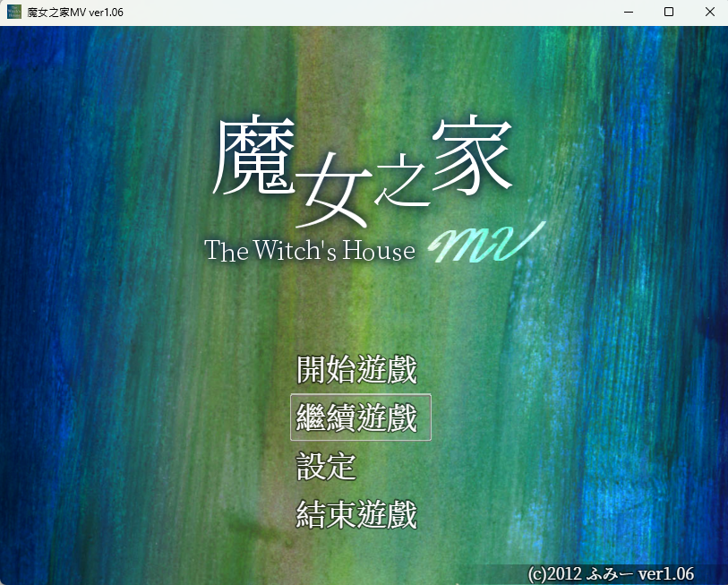

今天晚上跟蝦波一起玩她之前[推薦](/blog/2026/06/07/old_game)過的魔女之家，這個 2012 年出品的經典 2D 恐怖遊戲，大概國高中的時候就有聽過，但是從來沒有玩過。

我這次玩的是 2018 年在 Steam 上的[重製版](https://store.steampowered.com/app/885810/The_Witchs_House_MV/?l=tchinese)[^1]，超級推薦，恐怖程度我覺得一般人應該也接受的了。

## 遊戲體驗

操作很簡單，解謎的難度非常剛好，不會難到解不出來，又同時保有思考的樂趣。Jump Scare 的次數控制的還 OK，我個人覺得非常剛好，不會廉價到令人煩躁的程度，氣氛掌握的也很恰當，微微讓人發毛的感覺。

我最後玩出了兩種結局，Wiki 上面還有一種最完整的黑貓結局，這裡防雷就不附上連結了。

總之非常推薦這款，遊戲時長也很剛好，我最後花了 106 分鐘通關，沒有體驗過的朋友可以花一杯手搖飲的錢試試看，我相信不會失望的。

[^1]:現在剛好在 Steam 上打三折，特價到 06-25，是史低喔！

