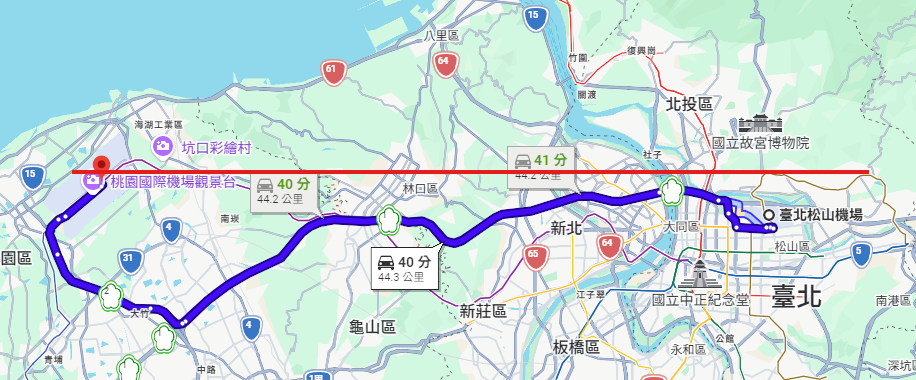
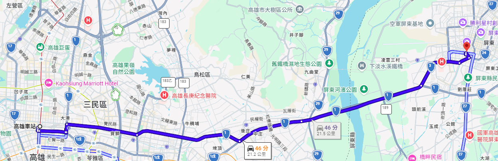

import { White, Black } from '/src/components/Chess/ChessGame';

:::info
這是我的「[BlogBlog 同樂會 - 2026 年 7 月](https://blogblog.club/party/)」的投稿文章。本月主題是「[有趣的小知識或冷門概念](https://shuaixin.cc/Fun-Fact/)」，由[劉昕](https://shuaixin.cc/)主持。如果你有自己的部落格，歡迎一起來參加！
:::

## 冷門興趣中的知識

關於這篇投稿的定義，在 LQ7 的[〈羽球系列〉](https://lq7.tw/mood/thursday-badminton-4/)提到

>這些知識如果沒在玩魔法氣泡或者沒在打羽球的人我想是不可能知道的，但如果圈內人士應該是常識，這充其量只能說「冷門興趣中的知識」，而不是「冷門知識」。

這樣說好像有點道理，像是 **「西洋棋三步就可以被將死喔」**，好像對一般沒在下棋的人沒什麼意義，但是下棋的人大概都會知道的事。

<White pgn="1. e4 f6 2. d4 g5 3. Qh5#" />

或是 **「一顆魔術方塊[^1]隨意打亂，總共可能產生`43,252,003,274,489,856,000`種變化」**，大約是 4325 億億種。換一個比較好理解的說法，這個數字如果是新台幣的話，大概是 Elon Musk、Jeff Bezos、Mark Zuckerberg、黃仁勳財產加起來的「73 萬倍」。

## 日常生活的冷知識

其實我也想不出什麼「圈內人士都沒聽說的冷門知識」，輕鬆的日常冷知識我覺得才是最有趣的，劉昕在主題文中提到的 **「羊是牛科的哦」** 對我而言就超有趣了。

雖然可能很多人早就知道了，但我就來分享兩個我當初知道時，覺得很有趣的台灣地理冷知識吧。

1. **「你知道嗎？台灣本島最北的機場是桃園機場，不是松山機場喔！」**

2. **「你知道嗎？高雄車站到屏東車站其實是北上喔！」**

~~（但你還是要去南下月台搭車）~~

[^1]:這裡指大眾最普遍知道的 3x3 魔術方塊，官方 WCA 比賽最高階為 7x7 魔術方塊。
