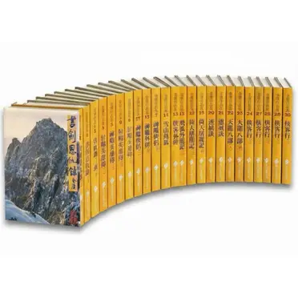

最近部落格做了一點小更新，把 Tier 排名類型的頁面從[興趣區](/docs/intro)額外隔了出來。除了電影、動漫、劇集之外，連拉麵店也整理了一個排名系統，整理時靈機一動，突然很想幫我童年最愛金庸武俠小說也玩一下排名制度。

排名的過程對我來說很有趣，明明排的內容自身都很熟悉，但卻從來沒有好好思考過，它們分別在我心中處於什麼樣的位置，算是一個最近新發現的，我很喜歡探索自己的方式。

## 金庸之於我

從我有記憶以來，家中就有一整套遠流出版社（黃皮版）的金庸修訂版[^1]全集，這套山水風景封面的版本真的深得我心，是所有版本裡我覺得最符合金庸小說意境還有我自己審美的一套，我的所有排名也是以這套二版的內容為主。

▲圖片來源取自網路

這套武俠小說從小學開始一路陪伴我到現在，作品都翻閱了無數次（我不喜歡的作品就讀比較少遍），再來就是小學放學，與家人晚餐時間必追的 TVB 金庸港劇[^2]，這些都是我的美好回憶，分別有：

- [《射鵰英雄傳》（1994年）](https://zh.wikipedia.org/zh-tw/%E5%B0%84%E9%B5%B0%E8%8B%B1%E9%9B%84%E5%82%B3_(1994%E5%B9%B4%E9%9B%BB%E8%A6%96%E5%8A%87))：張智霖、朱茵版
- [《神鵰俠侶》（1995年）](https://zh.wikipedia.org/zh-tw/%E7%A5%9E%E9%B5%B0%E4%BF%A0%E4%BE%B6_(1995%E5%B9%B4%E9%9B%BB%E8%A6%96%E5%8A%87))：古天樂、李若彤版
- [《笑傲江湖》（1996年）](https://zh.wikipedia.org/zh-tw/%E7%AC%91%E5%82%B2%E6%B1%9F%E6%B9%96_(1996%E5%B9%B4%E9%9B%BB%E8%A6%96%E5%8A%87))：呂頌賢、梁藝齡版
- [《天龍八部》（1997年）](https://zh.wikipedia.org/zh-tw/%E5%A4%A9%E9%BE%8D%E5%85%AB%E9%83%A8_(1997%E5%B9%B4%E9%9B%BB%E8%A6%96%E5%8A%87))：黃日華、陳浩民、樊少皇版
- [《雪山飛狐》（1999年）](https://zh.wikipedia.org/zh-tw/%E9%9B%AA%E5%B1%B1%E9%A3%9B%E7%8B%90_(1999%E5%B9%B4%E9%9B%BB%E8%A6%96%E5%8A%87))：陳錦鴻、佘詩曼版
- [《倚天屠龍記》（2001年）](https://zh.wikipedia.org/zh-tw/%E5%80%9A%E5%A4%A9%E5%B1%A0%E9%BE%8D%E8%A8%98_(2001%E5%B9%B4%E9%9B%BB%E8%A6%96%E5%8A%87))：吳啟華、黎姿、佘詩曼版
- [《碧血劍》（2001年）](https://zh.wikipedia.org/zh-tw/%E7%A2%A7%E8%A1%80%E5%8A%8D_(2000%E5%B9%B4%E9%9B%BB%E8%A6%96%E5%8A%87))：林家棟、佘詩曼版

TVB 的金庸系列，是我心目中有史以來最好的金庸連續劇，不論是在選角、劇本流暢度、演技台詞跟口條，都樂勝現代大陸翻拍的版本，花裡胡哨的武功特效看起來很假，非常不喜歡。我從不認為武功是金庸最重要的看點，金庸把它們寫得非常有趣沒錯，但它終究是這個世界觀的引子，最終目的在於，讓讀者接觸一個個活生生有血有肉的角色。像是連城訣後記提到，這本小說的原型是紀念金庸小時候一位對他很親切的一個老人，發生過被冤枉入獄的真實遭遇（他當然不會武功）。

或許是記憶產生的偏見，當我再讀金庸時，黃容古靈精怪又俏皮的形象，總會讓我浮現朱茵的身影；看到周芷若楚楚可憐的表現，就會冒出佘詩曼的容顏；蕭峰的豪氣萬千、段譽的死皮賴臉、虛竹的木訥迂腐，黃日華、陳浩民、樊少皇就會一起出現，隨著文字在我腦中流動著。

我喜歡金庸小說文學上的描繪，文白夾雜的質感使得畫面感非常好。我也喜歡金庸串插各種朝代歷史，揉合歷史與虛構人物這種真真假假的方式，產生很棒的代入感，例如碧血劍與鹿鼎記中，闖王李自成的片段，都描寫得很有意思，或是楊過用彈指神通擊斃蒙哥，換得襄陽城十三年和平的改寫。金庸筆下角色也塑造得很有趣，尤其是怪誕特異的角色[^3]，不論好與壞，角色魅力都十分強烈，令人不由自主得著迷。 

## 作品排名

### 「飛雪連天射白鹿，笑書神俠倚碧鴛」

這兩句經典對聯代表著金庸的十四部作品[^4]，要將它們一一排序實在困難，每部都是水準之上的佳作，推薦全系列都讀，才是正確答案！

import JinYungTier from '@site/src/components/JinYungTier';

<JinYungTier/> 

[^1]:讀者間俗稱的二版

[^2]:寫這篇才想到，我應該把它們加到[劇集清單](/docs/series)

[^3]:像是風清揚、東方不敗、夏雪宜、周伯通、謝煙客、天山童姥、林朝英、毒手藥王等

[^4]:對聯中還缺一部短篇《越女劍》

