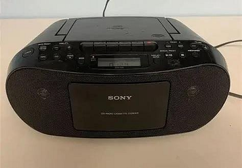

最近找到小時候的回憶──整套《相聲瓦舍》出的錄音版本[相聲段子](https://www.youtube.com/watch?v=XcZZO2V1YCk&list=PLNr3ClkvEj6iRhpU60KsIa6aMUYQ6iHqT)，這裡面一共有 42 個十分鐘左右的小段子，趕緊用 yt-dlp 下載下來回味。大概小學的時候，家裡有一臺 sony 的老收音機[^1]，每天睡覺前都聽這套 CD，偶爾也會在 FM 收音機聽到相聲瓦舍的相聲劇（像是東廠僅一位），每天聽下來，幾乎把所有段子都聽到倒背如流了，在那個沒有智慧型手機的時代，這些對我來說真的非常有趣，即使放到現在，我覺得也不輸大多數的娛樂內容。

## 相聲瓦舍回憶

《相聲瓦舍》的相聲劇系列也是我小時候的重要回憶。大約是小學五、六年級，某一堂課要分組準備期末表演，我和一個好朋友一起表演[〈比壞〉](https://www.youtube.com/watch?v=HpJFdhMrpDc)這個經典段子，那時候每到假日我就跑到他家，一起用電腦把逐字稿整理出來背，平常下課練習的時候，就會有一些同學圍過來，聽得津津有味的，果然最後表演大成功，我記得連老師都笑得非常開心，就算超時也說沒關係，讓我們全部表演完，真可惜沒有那時候的表演錄影。

上大學之後，記得假日約了高中同學肥凱和溶翔一起去台南看《相聲瓦舍》的劇場表演，不過差不多那個時期之後的作品，開始沒有那麼喜歡，所以漸漸就沒有再繼續 follow 後續的作品了。

## 推薦

來推薦一下錄音 CD 這套裡面的幾個段子，每則都滿值得聽的，很喜歡當睡前故事。

1. 《我是乾隆皇》：對春聯的主題我很喜歡，一定要聽看看
2. 《報菜名》：經典的相聲老段子，小時候無聊還曾經背過一小段
3. 《集體即興創作》：我最喜歡的一則無厘頭小段子
4. 《口吐蓮花》：吊著聽眾的胃口，很高明有趣的文本
5. 《奪命列車》：小時候聽有點害怕，鬼故事型式的相聲非常前衛

經典的長篇相聲劇也要來推薦一下[^2]

1. 《東廠僅一位》：應該是瓦舍最紅的相聲劇，〈十八層公寓〉聽過數十遍也不膩
2. 《記得當時那個小》：很喜歡〈聯誼〉，真的很好笑
3. 《蔣先生，你幹什麼》：〈比壞〉太經典的一定要聽
4. 《借問ㄞˋ教授》：推理型式的劇本很有創意，喜歡
5. 《又一村》：很有印象小時候在家反覆看〈竹林七嫌〉的 DVD，很喜歡這個日本經典文學《竹籔中》的改編劇本
6. 《惡鄰依依》：很有故事性，其中的歷史和政治隱喻我都覺得挺不錯
7. 《迷香》：分飾多角很厲害，我也很喜歡這個劇本，把劇情在各段拼湊起來，很有看電影的感覺

[^1]:有點像這張網路上找的照片，但不太確定，好像型號沒那麼新
[^2]:有興趣的話可以上網找一下，喜歡這些作品可以到[瓦舍官方](https://www.ngng.com.tw/product-category/%e5%85%a8%e9%83%a8%e5%95%86%e5%93%81/)購買收藏
