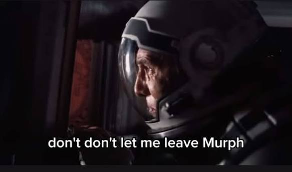

每年一度報名技師的日子又到了，被同事說服後，還是乖乖按下報名按鈕，即使今年都還沒開始讀書。

去年考試的那個週末，因為馬太鞍溪的案子，結果連考場都沒有去，其實當時心裡的想法是：都浪費報名費了，不能連兩天 16 小時也浪費掉。今天還笑著跟同事說，每年這樣報名根本是在繳年費，而且還漲價變成 2300 塊了，感覺好像什麼坑人的 disney+ 方案似的。

對於現在的生活，有沒有考到技師牌有很大的差別嗎，其實也還好，就每個月薪水多一萬塊而已。最大的差別是自我滿足吧，記得 2022 年的時候，許過無聊的新年新希望是魔術方塊在 WCA 比賽上單次 10 秒內還有考到技師牌，想當然魔術方塊很快就達到目標了，然而考牌如浮雲一般，在夢境與現實之間載浮載沉著。俗話說：時間花在哪，成就就在哪裡果然一點也不錯。

沒考到牌也有一個讓我渾身不舒服的感覺，我想要學日文、學游泳、學桌球、寫部落格、看電影、玩遊戲，但卻好像有個聲音一直告訴我，考完牌這些都可以盡情去做了，雖然讓自己放寬心，直接去做自己想做的事就好了，但這個念頭總是像一根魚刺一樣，時時札在我的腦海中，一直讓我想到「逃」（不對吧你又不是奇犽，別抄獵人阿），不過話說回來，今年到現在都已經八月了，還沒有開始讀書的我，似乎也沒資格說自己沒有任性的做自己想做的事，明明在部落格玩得那麼開心。

總之，有了部落格之後，有地方留下證據給自己壓力，未嘗不是一件好事。寫完這篇文章時間也晚了，不宜讀書，繼續看《臺灣漫遊錄》吧。

明年放榜當天的我 be like：

