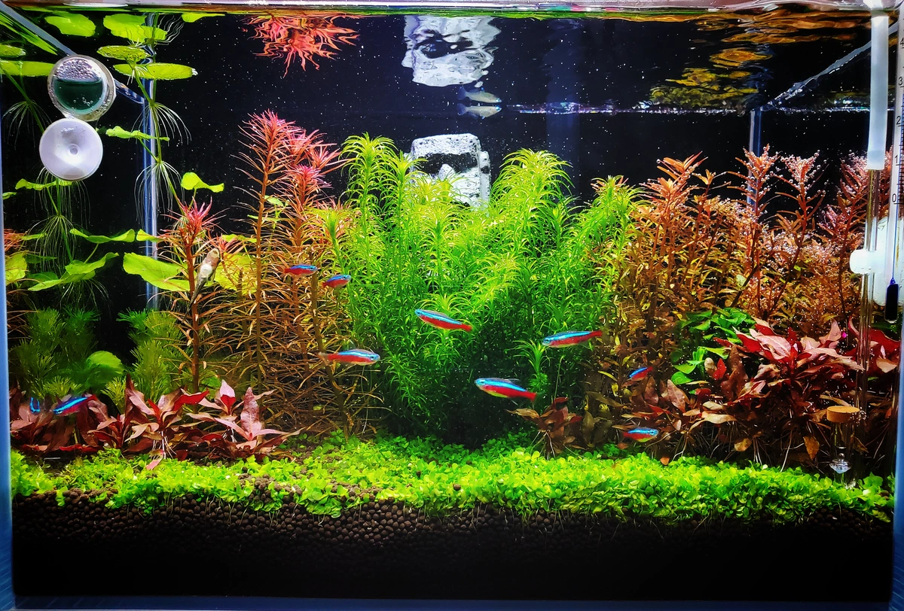
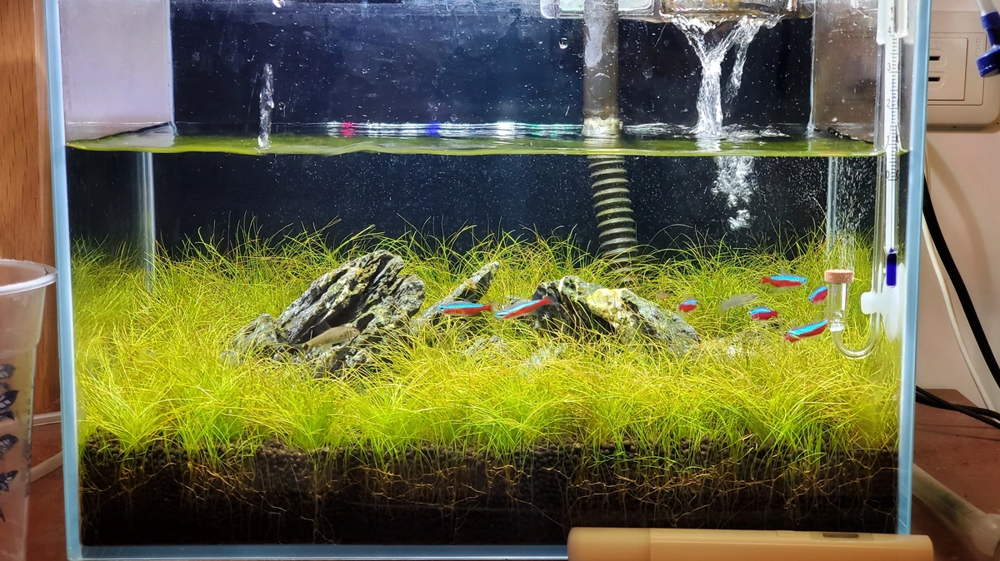
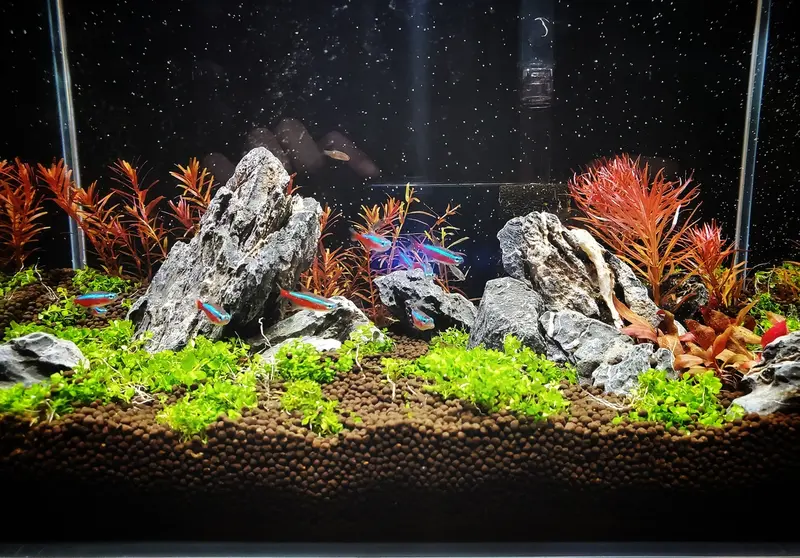
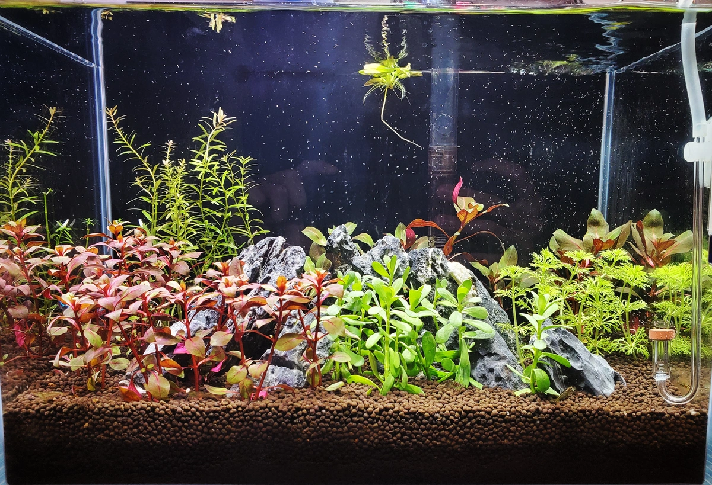
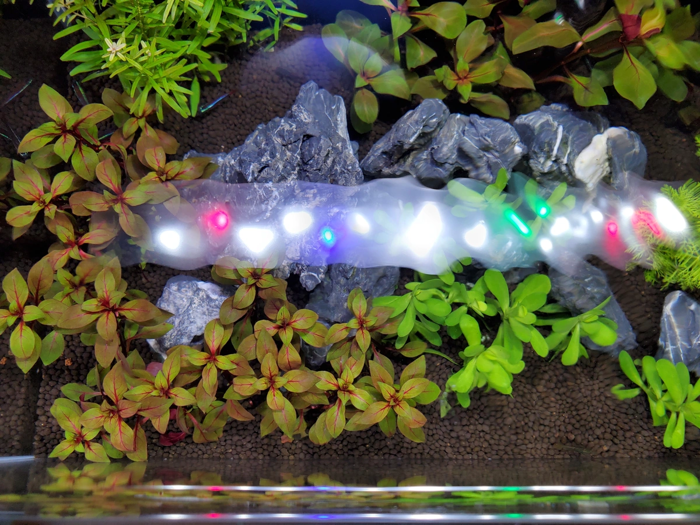
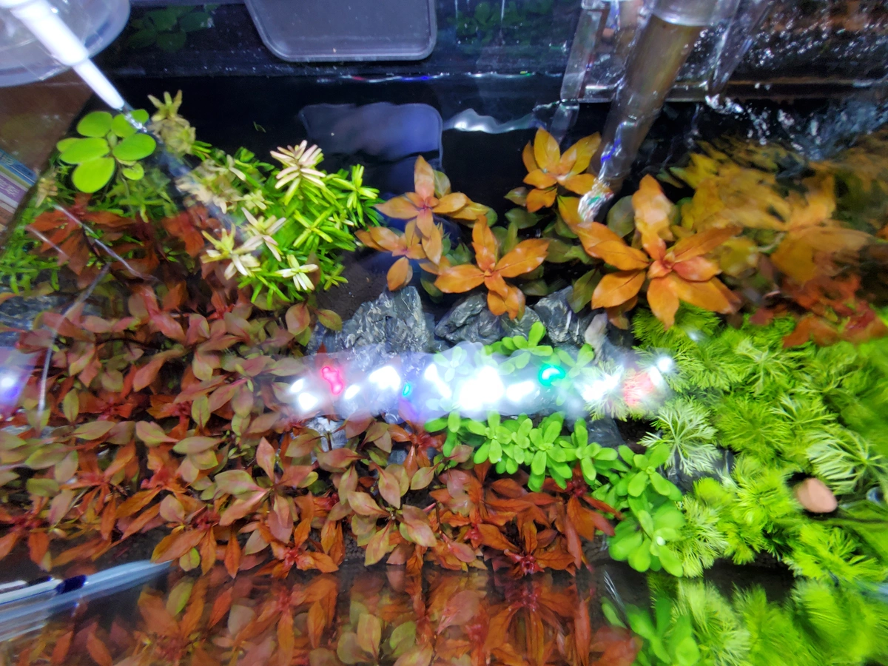
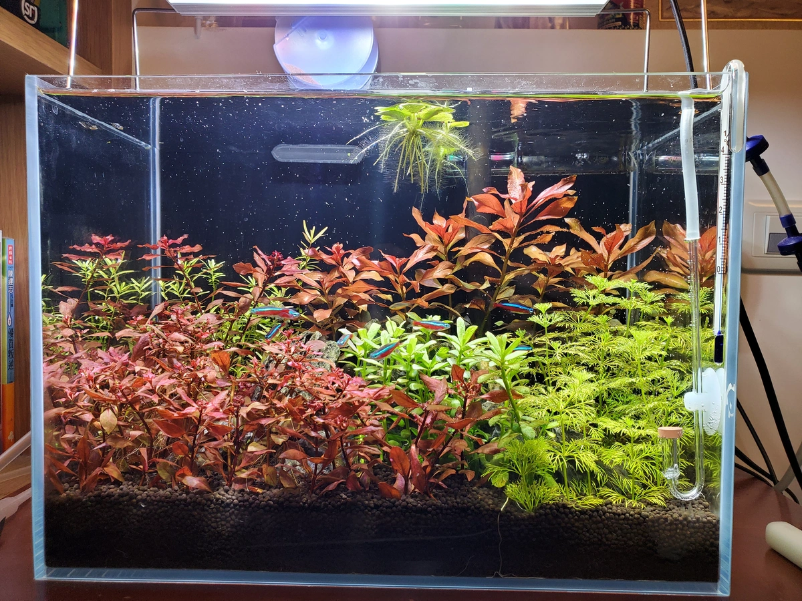
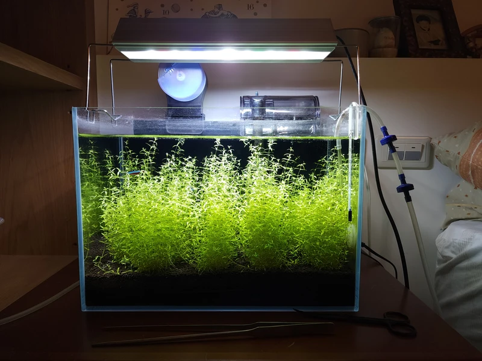
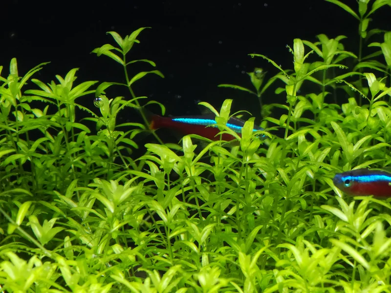
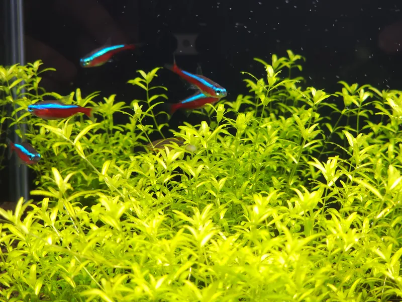

# 水族造景
以下是我有陣子很愛玩水草缸的造景。

# 設備
* 魚缸：億鼎36x22x26超白缸
* 燈光：ISTA 高之光 35cm
* 過濾：七星SF-1000外掛+底版過濾
* 打氣機：GEX 1500S單孔
* CO2：ISTA旅瓶+NEO Co2陶瓷細化器
* 添加劑：atr總硬度提升劑
* 水質檢測：小米 TDS水質檢測筆

:::note
水族筆記持續更新中。
:::