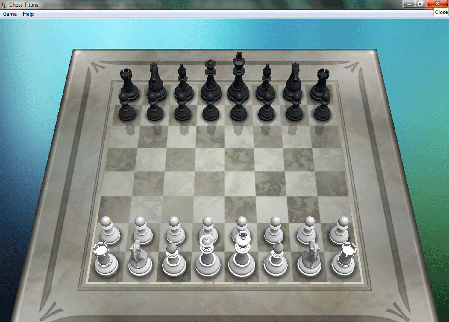
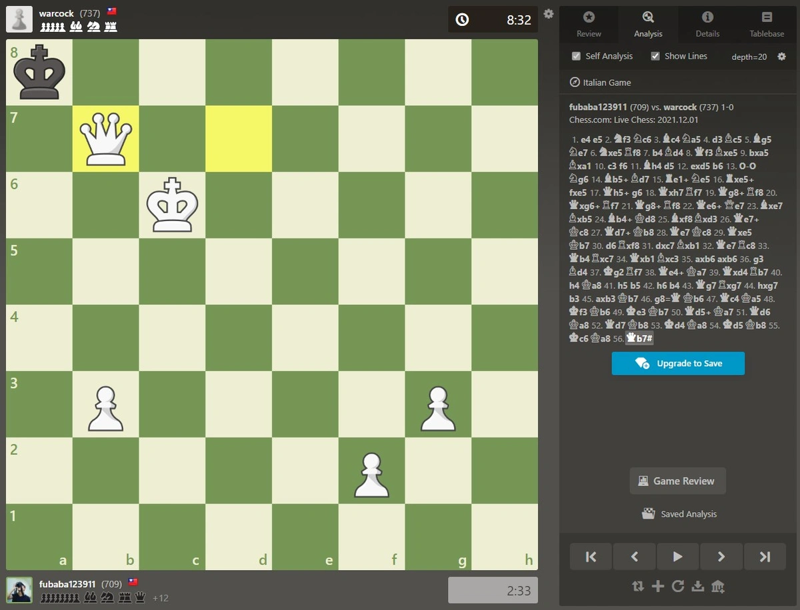

## Chess Titans
小時候家裡的電腦是Windows Vista系統，內建了一個西洋棋遊戲[Chess Titans](https://zh.wikipedia.org/zh-tw/Chess_Titans)，但是我不知道棋子的規則和走法，所以從來沒有完整下贏電腦過，這也是我第一次接觸西洋棋遊戲。

## 后翼棄兵

2020年，Netflix上架了[后翼棄兵](https://zh.wikipedia.org/zh-tw/%E5%90%8E%E7%BF%BC%E6%A3%84%E5%85%B5_(%E8%BF%B7%E4%BD%A0%E5%8A%87))迷你影集，講述架空的1950年代，天才西洋棋手Beth Harmon奪得西洋棋世界冠軍的故事。人物、劇本、畫面都是上乘之作，在我開始下西洋棋後，又再看了一遍，非常推薦大家去看。

## 研究所時期

看完美劇後，我上網學習了西洋棋的規則，最有趣的規則就是["國王入堡(Castling)"](https://zh.wikipedia.org/zh-tw/%E7%8E%8B%E8%BB%8A%E6%98%93%E4%BD%8D)，只要用出來就會覺得自己很帥。

研究所時期，我常常跟我的研究室同學兼室友一起下棋，兩個人都不會下，就覺得特別有趣，這是我的第一盤真人對局，當時覺得自己棄堡攻殺成功太帥了，下了四十分鐘，有完整的棋譜，現在擺出來應該會覺得這個對局很好笑。

比起跟電腦死板的下，我跟推薦初學者找個好朋友，或是情侶夫妻一起玩，搜尋[Chess.com](https://www.chess.com/home)[^1]或是[Lichess.org](https://lichess.org/)[^2]就可以馬上開始戰鬥了。

## 開局基本介紹

後來因為好勝心，就不斷的研究西洋棋的觀念，我主要都是在Youtube上利用免費的資源學習，認識各種不同的開局會覺得非常有趣，可以根據自己的喜好和棋風選擇開局，就像新手冒險者選擇職業和武器一樣。

### 白方開局
1. 王兵開局：全世界最主流的開局，在`1. e4 e5 2. Nf3 Nc6`後，白方可以選擇非常多開局與對手進行遊戲，每種開局都有各種變例可以抉擇，著名的舉凡義大利開局(Italian game)、西班牙開局(Ruy López)、蘇格蘭開局(Scotch game)、三馬開局(Three Knights Game)。
1. 后兵開局：全世界第二主流的開局，在`1. d4 d5 2. c4`後，就是后翼棄兵開局，背後有豐富的理論知識，在`dxc4`接受棄兵的對局中，可以快速兵`e5`搶佔中心，就算沒有任何開局知識，帥就完事了。

### 黑方防禦
由於全世界最主流的第一步棋是`e4`王兵開局，作為黑方的第一步棋，我們就可以選擇各種防禦手段來進行抗衡。如果面對后兵開局或其餘各式各樣的開局，就要另外學習更多的應對，不過也不用害怕自己理論知識不足，只要有正確的觀念，每一步棋都符合棋理，下什麼都是沒問題的。

### 激烈對戰
1. 王兵防禦(e5 Open game)`1. e4 e5`：直接挺起王兵佔領中心，來場直球對決吧，全世界下最對多的防禦，缺點是對手肯定也是有備而來。
2. 西西里防禦(Sicilian defence)`1. e4 c5`：利用`c5`兵佔領中心，讓戰場不對稱且複雜化，這是王兵開局中理論知識最多又最進攻型的防禦，是后翼棄兵中Beth Harmon最驕傲的防禦[^3]。

### 穩健試探
1. 法蘭西防禦(French defence)`1. e4 e6`：先不佔領中心，等對方搶占後，再尋求反擊，例如法蘭西推進變例`1. e4 e6 2. d4 d5 3. e5 c5`，利用`c5`兵迅速挑戰白方是個很經典的開局。
2. 卡羅康防禦(Caro-Kann defence)`1. e4 c6`：與法蘭西防禦類似，但是先不走起e6兵，試圖將白格主教復活後再尋求反擊中心，但是反擊的速度會比法蘭西防禦更慢。
3. 現代防禦(Modern defence)`1. e4 g6`：未來準備將黑格主教配置在`g6`，變成一個堡壘象(fianchetto)的結構。

其餘常見的還有舉凡斯堪地那維亞防禦(Scandinavian defence)、阿廖欣防禦(Alekhine's Defence)、歐文防禦(Owen's Defense)，或是叫不出名字的怪異野路子，都可以嘗試玩玩看呦！

## 學習資源

我推薦現在這個年代可以直接看影片學習，並且直接使用電腦上的棋盤配合引擎[^4]，例如[Lichess工具/分析對局](https://lichess.org/analysis#1)進行擺譜學習，以效率來說會比拿實體棋更佳，但是實體棋會更有下棋的氛圍，看個人選擇。

### 台灣西洋棋頻道

* [Rey的西洋棋](https://www.youtube.com/@reychess)：我最開始學習的啟蒙頻道，教學的非常仔細清楚，有時候教學影片看多了，覺得比較枯燥的時候，可以直接看實戰系列，學習棋手在對戰時的思路是很重要的。
* [BoGen西洋棋](https://www.youtube.com/@Moladas)：綜合型西洋棋頻道，有教學、迷因也有經典對局解說，或是西洋棋新聞。
* [Kevin西洋棋](https://www.youtube.com/@kevin-sg5yk/videos)：也是實戰類型的解說，但是很久沒更新了。
* [GMRaymond西洋棋](https://www.youtube.com/@raymondsongchess/videos)：台灣第一位GM特級大師的頻道，不常更新但是內容觀念絕對是一流的，適合有一定程度再觀看。

### 英文西洋棋頻道

* [Daniel Naroditsky](https://www.youtube.com/@DanielNaroditskyGM)：我最推薦的英文頻道，美國頂尖GM特級大師，他的實戰Speedrun系列講解的非常透徹而且仔細，從基礎程度的對手一路到大師等級。
* [ChesswithAkeem](https://www.youtube.com/@ChesswithAkeem)：CM候補大師，他的教學非常好，不論新手向或是進階棋手都可以學到東西，簡單實用的觀念非常推薦。
* [Eric Rosen](https://www.youtube.com/@eric-rosen)：IM國際大師，他喜歡棄子(Gambit)類型的棋風，實戰系列講解的不錯，而且我喜歡他冷靜沉穩的風格。
* [GothamChess](https://www.youtube.com/@GothamChess/videos)：IM國際大師，最大的西洋棋頻道，可以找到比較久以前有教學內容很也不錯，但現在大多數都是娛樂內容，覺得有趣可以看。
* [GMHikaru](https://www.youtube.com/@GMHikaru)：世界超頂尖的GM特級大師，現在是西洋棋綜藝實況主，推薦娛樂看。
* [Magnus Carlsen](https://www.youtube.com/@themagnuscarlsen/videos)：西洋棋界GOAT，我覺得頻道沒什麼適合新手的內容，但可以來瞧瞧歷史以來創下最高分的棋手。

[^1]: Chess.com是全世界最大的西洋棋平台，用戶眾多，免費就可以玩了。
[^2]: Lichess，是完全免費的非營利自由開源西洋棋服務，還有免費的引擎分析，超棒的。
[^3]: Beth的棋風變化尖銳且複雜，非常符合她的的性格，堅毅、不服輸，面對男性強權一樣無所畏懼。
[^4]: 使用引擎請在對局前後學習使用，在對局中使用是不尊重對手的作弊行為，也會被平台偵測到並且懲罰喔。