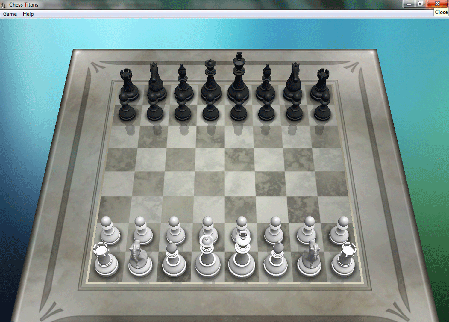
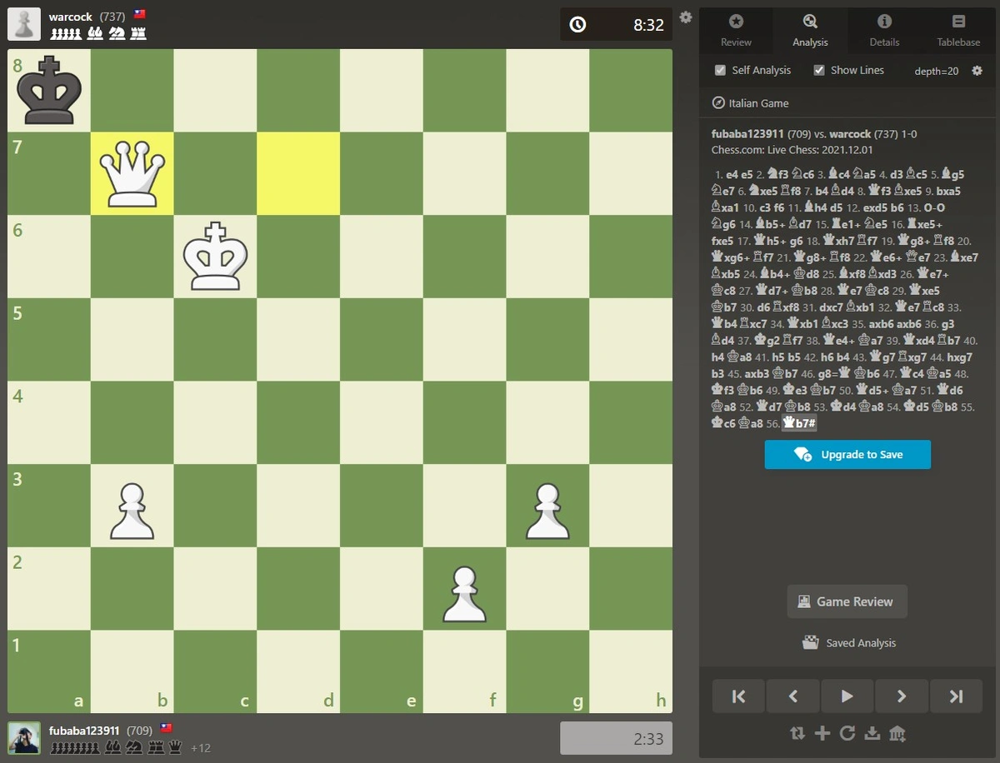

import { White, Black } from '/src/components/Chess/ChessGame';

## Chess Titans
小時候家裡的電腦是 Windows Vista 系統，內建了一個西洋棋遊戲 [Chess Titans](https://zh.wikipedia.org/zh-tw/Chess_Titans)，但是我不知道棋子的規則和走法，所以從來沒有完整下贏電腦過，這也是我第一次接觸西洋棋遊戲。

## 后翼棄兵

2020 年，Netflix 上架了[后翼棄兵](https://zh.wikipedia.org/zh-tw/%E5%90%8E%E7%BF%BC%E6%A3%84%E5%85%B5_(%E8%BF%B7%E4%BD%A0%E5%8A%87))迷你影集，講述架空的 1950 年代，天才西洋棋手 Beth Harmon 奪得西洋棋世界冠軍的故事。人物、劇本、畫面都是上乘之作，在我開始下西洋棋後，又再看了一遍，非常推薦大家去看。

## 研究所時期

看完美劇後，我上網學習了西洋棋的規則，最有趣的規則就是[「國王入堡(Castling)」](https://zh.wikipedia.org/zh-tw/%E7%8E%8B%E8%BB%8A%E6%98%93%E4%BD%8D)，只要用出來就會覺得自己很帥。

研究所時期，我常常跟我的研究室同學兼室友一起下棋，兩個人都不會下，就覺得特別有趣，這是我的第一盤真人對局，當時覺得自己棄堡攻殺成功太帥了，下了四十分鐘，有完整的棋譜，現在擺出來應該會覺得這個對局很好笑。

:::note
現在擺出來真的覺得下超爛 XD
:::

<White pgn="1. e4 e5 2. Nf3 Nc6 3. Bc4 Na5 4. d3 Bc5 5. Bg5 Ne7 6. Nxe5 Rf8 7. b4 Bd4 8. Qf3 Bxe5 9. bxa5 Bxa1 10. c3 f6 11. Bh4 d5 12. exd5 b6 13. O-O Ng6 14. Bb5+ Bd7 15. Re1+ Ne5 16. Rxe5+ fxe5 17. Qh5+ g6 18. Qxh7 Rf7 19. Qg8+ Rf8 20. Qxg6+ Rf7 21. Qg8+ Rf8 22. Qe6+ Qe7 23. Bxe7 Bxb5 24. Bb4+ Kd8 25. Bxf8 Bxd3 26. Qe7+ Kc8 27. Qd7+ Kb8 28. Qe7 Kc8 29. Qxe5 Kb7 30. d6 Rxf8 31. dxc7 Bxb1 32. Qe7 Rc8 33. Qb4 Rxc7 34. Qxb1 Bxc3 35. axb6 axb6 36. g3 Bd4 37. Kg2 Rf7 38. Qe4+ Ka7 39. Qxd4 Rb7 40. h4 Ka8 41. h5 b5 42. h6 b4 43. Qg7 Rxg7 44. hxg7 b3 45. axb3 Kb7 46. g8=Q Kb6 47. Qc4 Ka5 48. Kf3 Kb6 49. Ke3 Kb7 50. Qd5+ Ka7 51. Qd6 Ka8 52. Qd7 Kb8 53. Kd4 Ka8 54. Kd5 Kb8 55. Kc6 Ka8 56. Qb7#" />

比起跟電腦死板的下，我跟推薦初學者找個好朋友，或是情侶夫妻一起玩，搜尋[Chess.com](https://www.chess.com/home)[^1]或是[Lichess.org](https://lichess.org/)[^2]就可以馬上開始戰鬥了，下久了就會愈來愈上癮。

持續下到了現在出社會了，偶爾也會參加棋聚，這真的是個很棒且可以持續一輩子的消遣，比我玩過任何電腦遊戲都還久。

[^1]: Chess.com是全世界最大的西洋棋平台，用戶眾多，免費就可以玩了。
[^2]: Lichess，是完全免費的非營利自由開源西洋棋服務，還有免費的引擎分析，超棒的。
