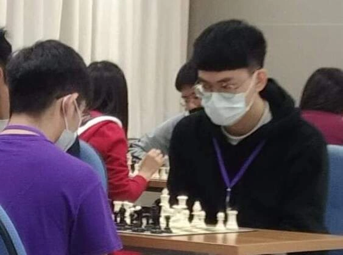
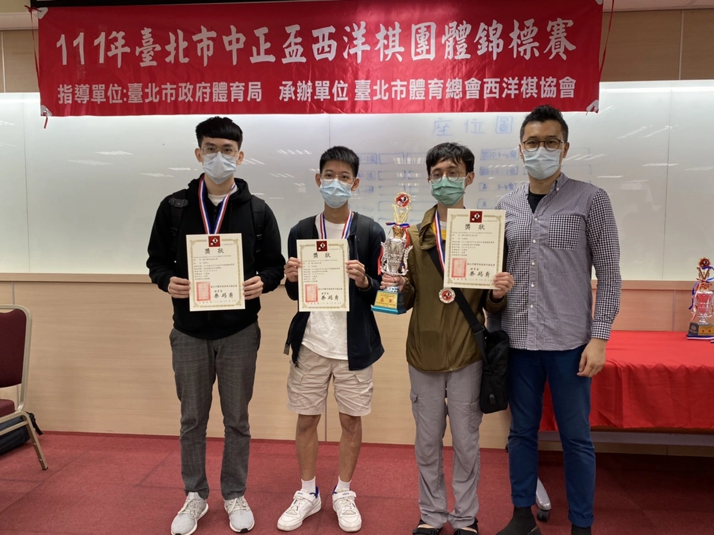
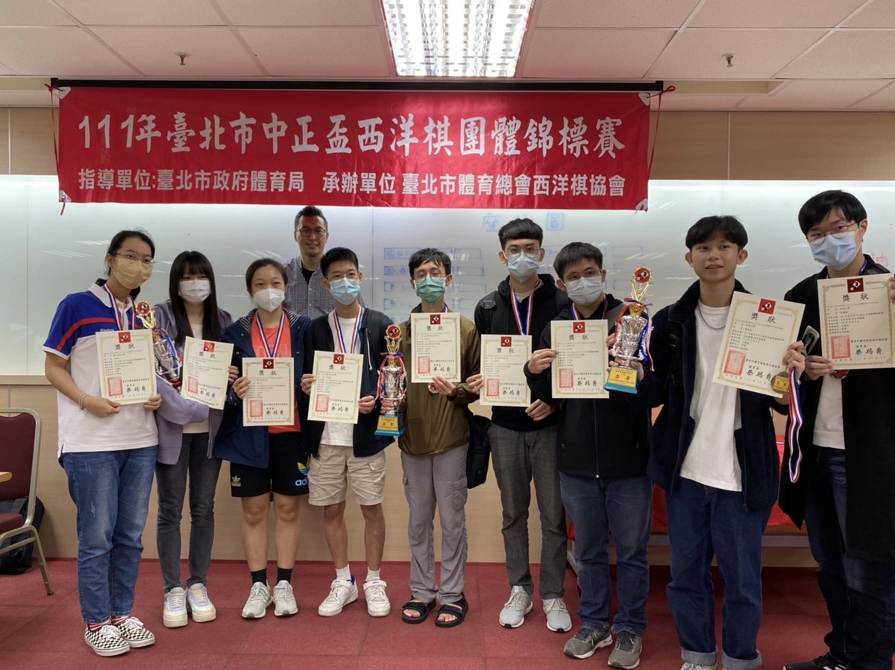
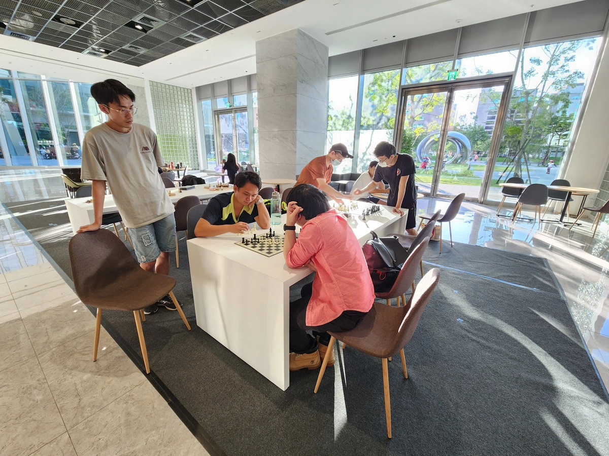
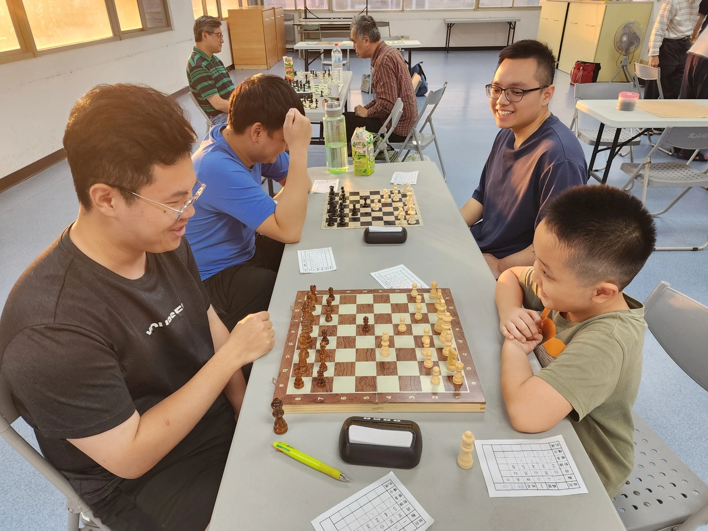
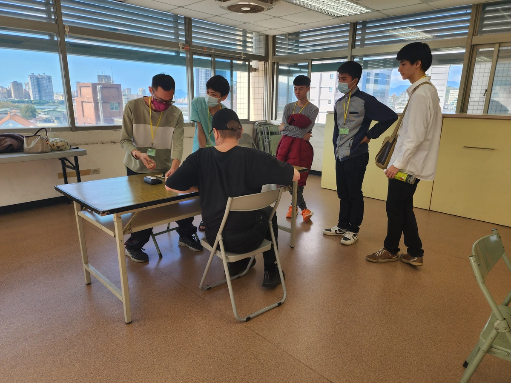

*最後更新：2025-09-21*

## 積分(Rating)

### 最高積分(Highest Rating)
#### [Chess.com](https://www.chess.com/member/fubaba123911)
* 中速棋(Rapid)：1801分
* 閃電棋(Blitz)：1665分
* 子彈棋(Bullet)：1504分
#### [Lichess](https://lichess.org/@/fubaba)
* 中速棋(Rapid)：2016分
* 閃電棋(Blitz)：1824分
* 子彈棋(Bullet)：1844分

### 積分成長史(Chess.com Rapid)
2021-12-17:達到800

>下了一個月的棋終於 800 分了！PR 值 52 ???

2022-01-05:達到900

>考完試爬個西洋棋分數。

2022-01-12:達到1000

>西洋棋 1000 分拉，邁向 1100 分！

2022-01-18:達到1100

>1100 分記錄。

2022-02-17:達到1200

>今年 1200 分目標達成了耶，不能再花那麼多時間下棋了，下次回鍋目標 PR90 ㄅ。

2022-04-16:達到1300

>龜爬兩個月終於 1300 分，別太沉迷閃電棋不會進步。

2022-05-26:達到1400

>回 Lichess 修練一個月有用，成功上 1400 分。

2022-12-08:達到1500

>從開始到 1400 分花了五個月，1400 分到 1500 分卻足足花了七個月，出去比賽真的開拓很多新視野，開局琢磨不多、中局計畫不順、殘局理論不熟，希望有朝一日能夠邁進 2000 分，挑戰國手選拔賽。

2023-09-04:達到1600

>過了九個月終於 1600 分，真的要認真練習慢棋才會進步，好想再出去比賽被電。

2024-10-07:達到1700

>這次一個月就上 1700 分了，可喜可賀，離目標只差 300 分了，希望一兩年內可以達到。

2025-05-09:達到1800

>這區區 100 分花了八個月，不知不覺下棋四年了。

:::note
持續更新中，加油努力邁向 2000 分！
:::

## 比賽紀錄
111年中正盃大專組團體賽亞軍（交大西洋棋社）

這盤棋有幸對到清華大學西洋棋社的翁玉芯（台灣國手，WCM 頭銜），持黑最後雙方都快沒時間，僥倖以時間獲勝。

有興趣可以看劉業揚老師（台灣國手，CM 頭銜）的解說：

  <iframe 
    width="560" 
    height="315" 
    src="https://www.youtube.com/embed/pdOKJP4bNJ8?si=zZ609cXguOx5PxFa" 
    title="YouTube video player" 
    frameborder="0" 
    allow="accelerometer; autoplay; clipboard-write; encrypted-media; gyroscope; picture-in-picture; web-share" 
    allowfullscreen>
  </iframe>

## 內湖棋聚
棋友蕭大主辦

地點：GO GO GEESAA COFFEE

## 景美棋聚
棋友張老師主辦

地點：i99 COFFEE

地點：景行區民活動中心

與目前台灣[FIDE台灣排名](https://ratings.fide.com/rankings.phtml?continent=0&country=TPE&rating=standard&gender=&age1=0&age2=0&period=2025-09-01&period2=1)第 11 的 Tapani 前輩下了一場精彩的斯堪地那維亞開局，持白獲勝，可惜沒有記錄棋譜。

