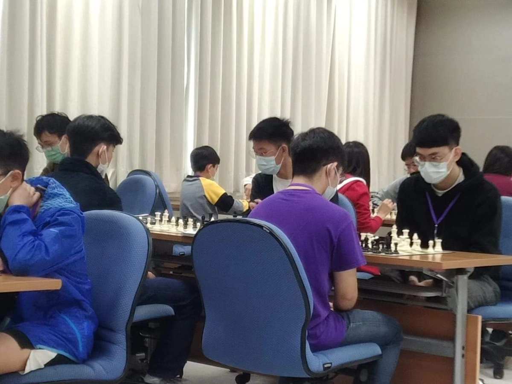

*最後更新：2025-09-21*

## 積分(Rating)

### 最高積分(Highest Rating)
#### [Chess.com](https://www.chess.com/member/fubaba123911)
* 中速棋(Rapid):1801分
* 閃電棋(Blitz):1665分
* 子彈棋(Bullet):1504分
#### [Lichess](https://lichess.org/@/fubaba)
* 中速棋(Rapid):2016分
* 閃電棋(Blitz):1824分
* 子彈棋(Bullet):1844分

### 積分成長史(Chess.com Rapid)
2021-12-17:達到800

>當時心得：下了一個月的棋終於800分了！PR值52???

2022-01-05:達到900

>當時心得：考完試爬個西洋棋分數。

2022-01-12:達到1000

>當時心得：西洋棋1000分拉，邁向1100分！

2022-01-18:達到1100

>當時心得：1100分記錄。

2022-02-17:達到1200

>當時心得：今年1200分目標達成了耶，不能再花那麼多時間下棋了，下次回鍋目標PR90ㄅ。

2022-04-16:達到1300

>當時心得：龜爬兩個月終於1300分，別太沉迷閃電棋不會進步。

2022-05-26:達到1400

>當時心得：回Lichess修練一個月有用，成功上1400分。

2022-12-08:達到1500

>當時心得：從開始到1400分花了五個月，1400分到1500分卻足足花了七個月，出去比賽真的開拓很多新視野，開局琢磨不多、中局計畫不順、殘局理論不熟，希望有朝一日能夠邁進2000分，挑戰國手選拔賽。

2023-09-04:達到1600

>當時心得：過了九個月終於1600分，真的要認真練習慢棋才會進步，好想再出去比賽被電。

2024-10-07:達到1700

>當時心得：這次一個月就上1700分了，可喜可賀，離目標只差300分了，希望一兩年內可以達到。

2025-05-09:達到1800

>當時心得：這區區100分花了八個月，不知不覺下棋四年了。

:::note
持續更新中，加油努力邁向2000分！
:::

## 比賽紀錄
111年中正盃大專組團體賽亞軍（交大西洋棋社）

[中正盃覆盤2 后兵開局 vs 尼姆佐維奇防禦](https://www.youtube.com/watch?v=pdOKJP4bNJ8&list=PL0OXdBIpu2-zm71dlOKSP1V5ivbI289qR)

這盤棋有幸對到清華大學西洋棋社的翁玉芯(台灣國手,WCM頭銜)，持黑獲勝。

有興趣可以看劉業揚老師(台灣國手,CM頭銜)的解說

## 內湖棋聚
GO GO GEESAA COFFEE

## 景美棋聚
i99 COFFEE

景行區民活動中心

與目前台灣排名11[^1]的Tapani下了一場精彩的斯堪地那維亞開局，持白獲勝

[^1]: [FIDE台灣排名](https://ratings.fide.com/rankings.phtml?continent=0&country=TPE&rating=standard&gender=&age1=0&age2=0&period=2025-09-01&period2=1)