# 演唱會
紀錄一下所有參加過的演唱會，太久以前連照片都翻不到的也沒辦法，只能留存在腦海裡了。

## [2026 蔡依林《PLEASURE》](https://shuojen.site/photoblog/2026/01/01/concert)

*2026-01-01*

 
 
## 2025 林俊傑《FINAL LAP》

*2025-06-07*

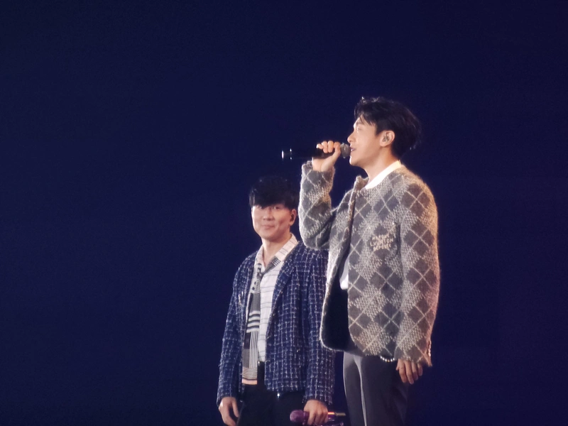 
 
## 2024 張惠妹《ASMR Maxxx》

*2024-12-31*

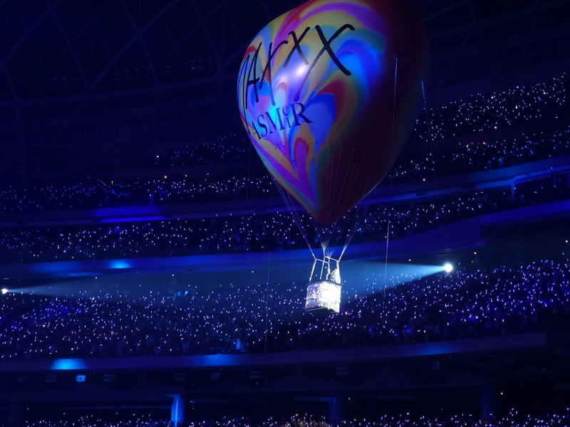 
 
## 2024 周杰倫《嘉年華》

*2024-12-08*

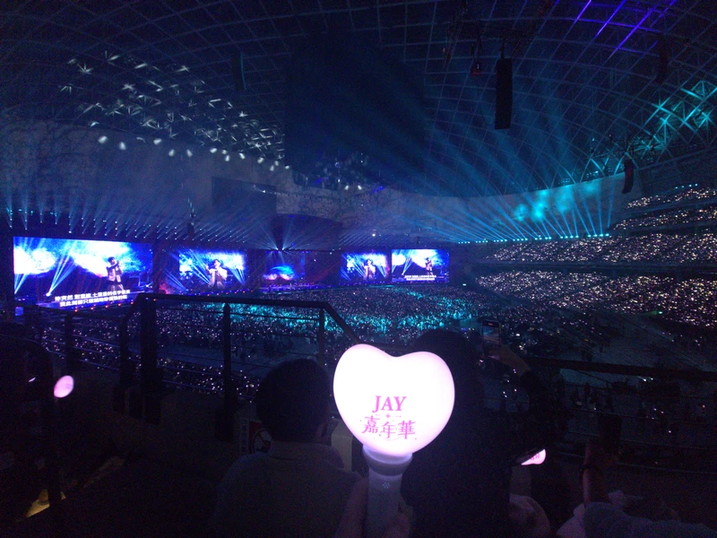

## 2024 劉德華《今天…is the Day》

*2024-11-02*

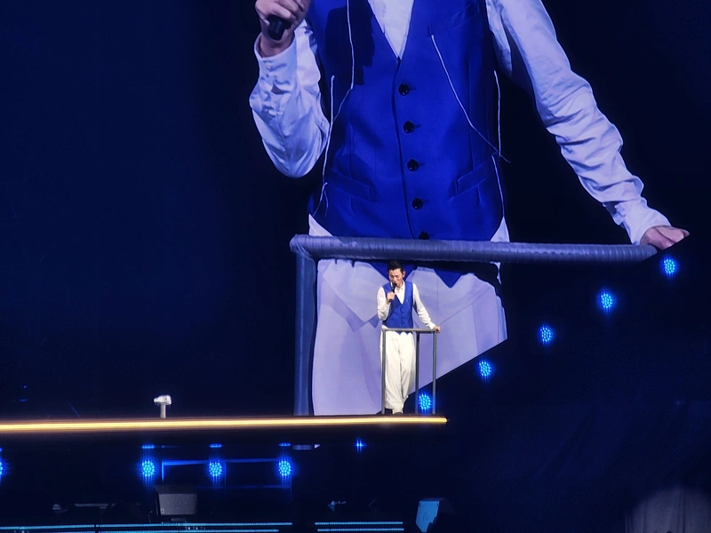 
 
## 2024 張學友《60+》

*2024-06-01*

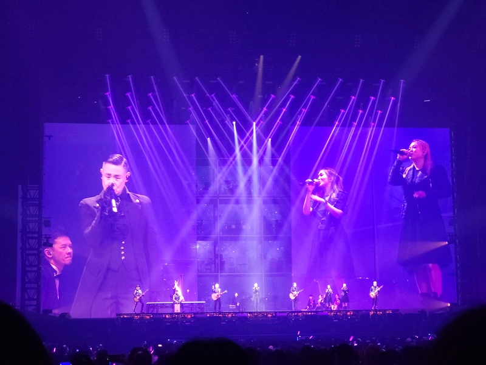 
 
## 2024 告五人《宇宙超有趣》

*2024-03-16*

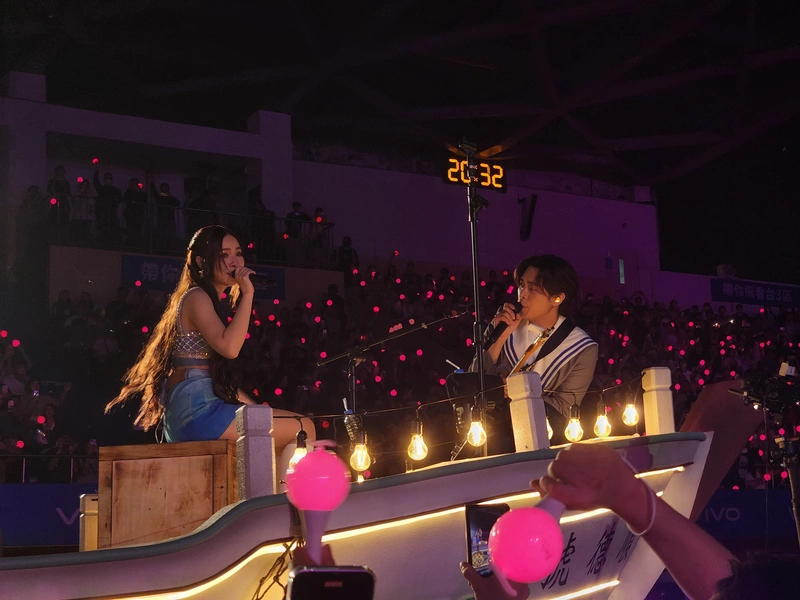 
 
## 2023 林宥嘉《idol》

*2023-12-16*

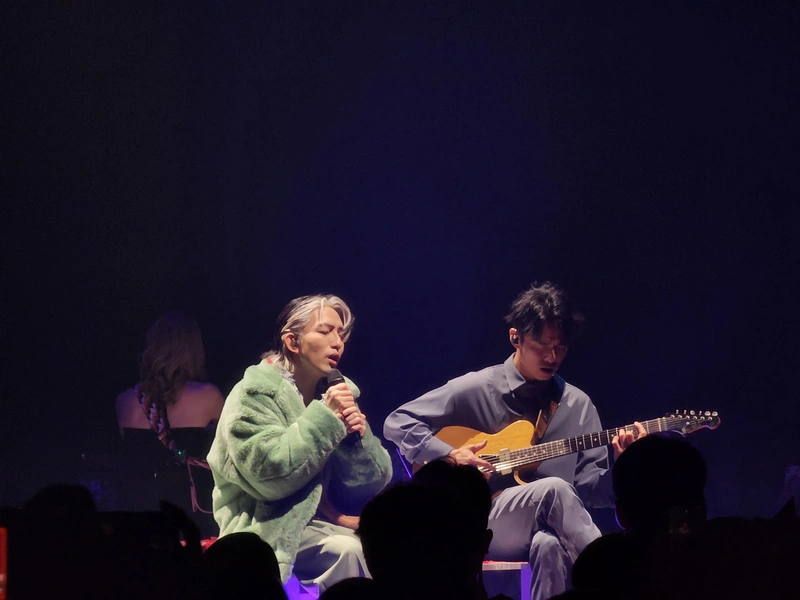 
 
## 2023 韋禮安《如果可以，我想和你明天再見again》

*2023-11-11*

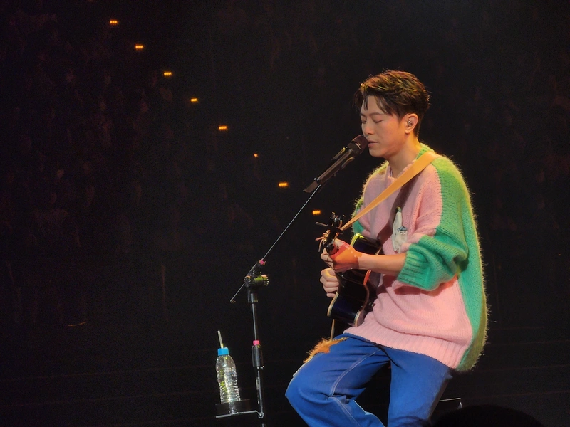 
 
## 2023 王力宏《ONE Leehom Wang一個王力宏》

*2023-09-09*

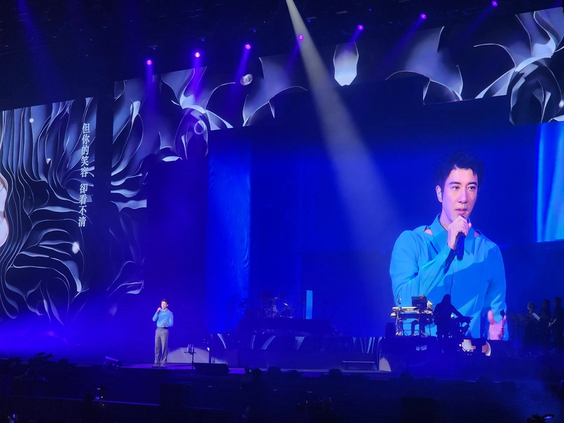 
 
## 2023 田馥甄《一一》

*2023-08-13*

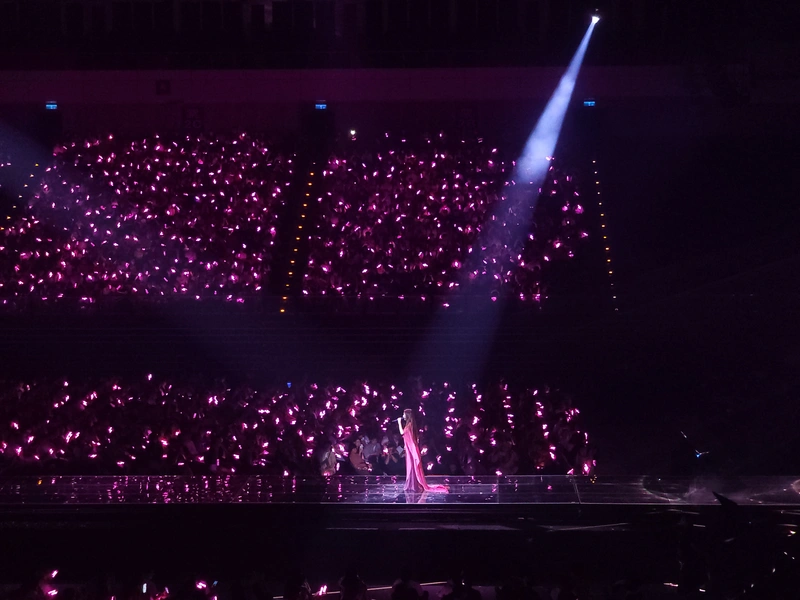 
 
## 2023 陳奕迅《FEAR AND DREAMS》

*2023-07-15*

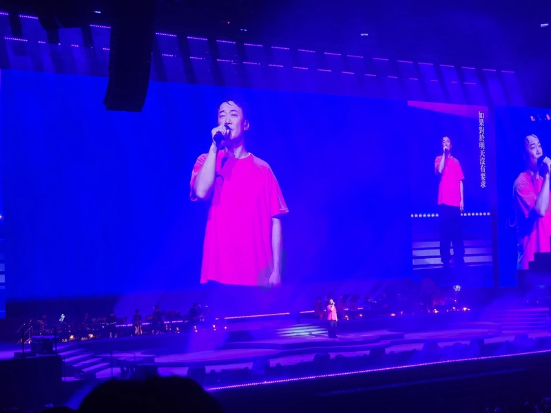 
 
## 2022 蕭煌奇《朋友你現在好嗎？》

*2022-12-25*

 
 
## 2022 盧廣仲《勵志的早晨勵志的夜晚》

*2022-12-03*
 
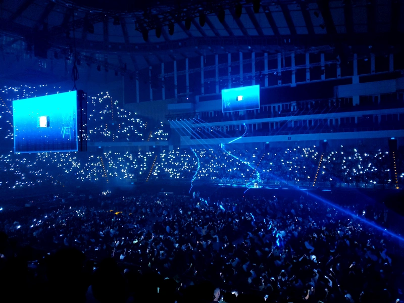 
 
## 2022 動力火車《都是因為愛》

*2022-03-05*

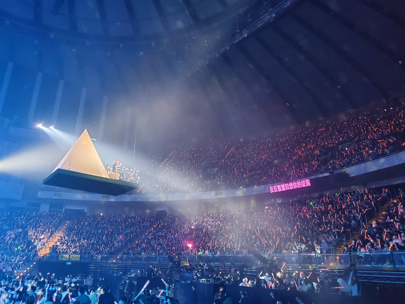 
 
## 2022 魚丁系《池堂影夜》

*2022-02-19*

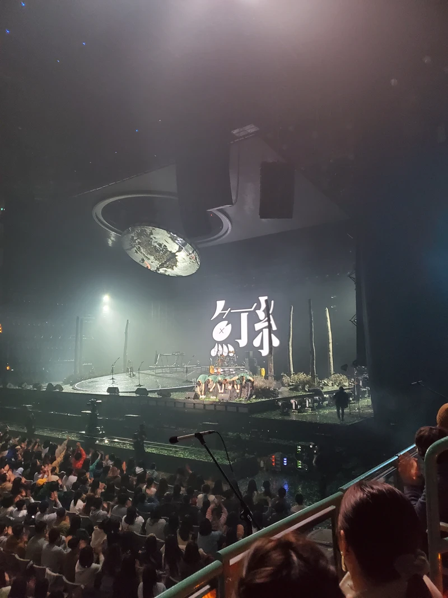 

## 2016 五月天《RE : LIVE -Just Rock It》

*2016-12-25*

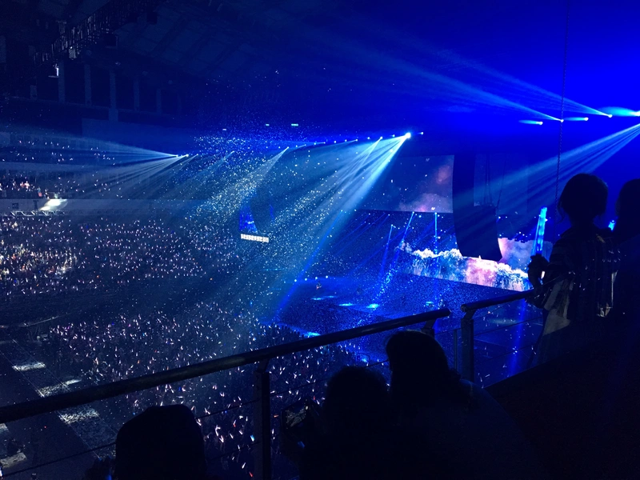 
 
## 2016 Sarah Brightman《Gala: An Evening》

*2016-08-07*

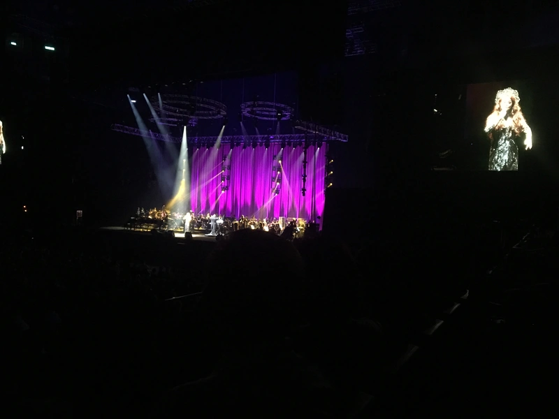 
 
## 2016 盧廣仲《What a Folk !!!!!!》

*2016-08-06*

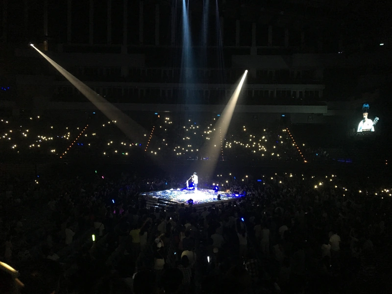 
