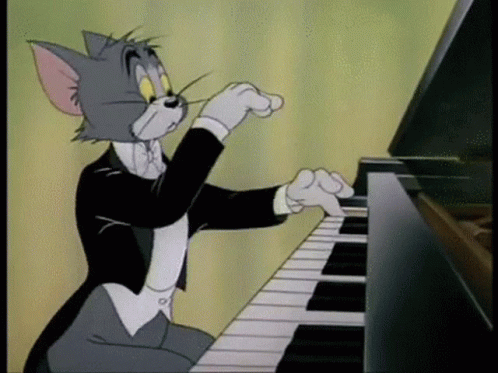

## 第一位鋼琴老師

我的第一位鋼琴老師姓林[^1]，在我的記憶中是個和藹可親的老奶奶，從小一到小六的每週六，我都會去老師的琴房練一小時的鋼琴，結束時等媽媽來接，老師就會拿餅乾糖果給我吃。有個印象是有一次等半小時，我直接吃掉半桶的脆迪酥。

### 最早記得林老師的印象

當時應該才三、四歲，媽媽帶我走進林老師的教室，我很開心的直接爬上老師的Yamaha鋼琴，隨意地按幾個琴鍵就超級開心，大人們都笑了。後來老師跟媽媽說我年紀還太小，所以就等到小學一年級才開始學琴的生涯。

### 學習內容

小時候回家其實也滿少練琴，只有喜歡的曲子會認真練習，彈最多的都是徹爾尼、拜耳、湯姆遜這些比較枯燥的基本教材，不過很感謝老師讓我打下鋼琴的基礎，讓我喜歡上音樂。

## 伍老師

因為林老師只收小一到小六的小朋友，後來國中的時候，我就跟我小時候好朋友黃英哲家的鋼琴老師學，黃英哲的哥哥、姊姊也都是給伍老師教，後來連我哥也跟伍老師學鋼琴。一直到我國二開始比較多學科的補習之後，就沒再學琴了。

### 學習內容

伍老師比較年輕所以比較隨興，比較多讓我們彈自己想彈的曲子，像一些古典的曲子還有周杰倫的電影琴譜也給我們彈。

## 四手聯彈

高中音樂課跟馬朗文一起四手聯彈(國中的時候也跟大隊長一起彈過)

<video controls width="320">
    <source src="/video/005.mp4" type="video/mp4" />

    抱歉，您的瀏覽器不支援內嵌影片。
</video>

:::note
有其他彈琴影片會再放上來。
:::

[^1]:寫這篇文章的時候才發現，我從來不知道老師的名字，只知道姓林