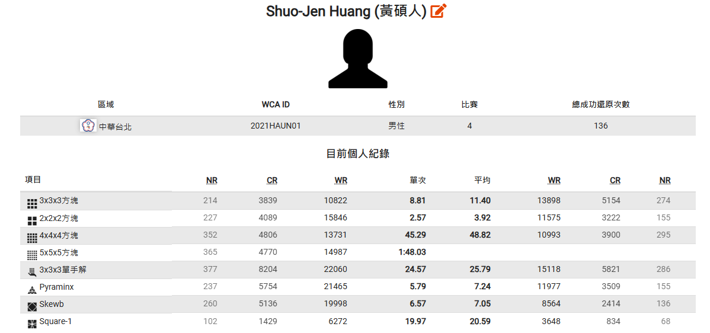

*最後更新2025-10-19*
## 比賽紀錄&成績
這是我的[世界魔術方塊協會(WCA)](https://www.worldcubeassociation.org/persons/2021HAUN01)頁面

### [2021台北回歸賽](https://www.worldcubeassociation.org/competitions/WelcomeBackTaipei2021)

我的人生第一場正式WCA魔術方塊比賽

* 刷新個人三階單次記錄11.51
* 刷新個人三階平均記錄12.59

* 刷新個人四階單次記錄56.90

* 刷新個人三階單手解單次記錄26.30

* 刷新個人斜轉單次記錄7.99
* 刷新個人斜轉平均記錄11.11

### [2022台灣公開賽](https://www.worldcubeassociation.org/competitions/TaiwanOpen2022)

* 刷新個人三階平均記錄12.07

* 刷新個人二階單次記錄2.57
* 刷新個人二階平均記錄4.66

* 刷新個人四階單次記錄45.29
* 刷新個人四階平均記錄54.77

* 刷新個人三階單手解單次記錄24.57
* 刷新個人三階單手解平均記錄25.79

* 刷新個人金字塔單次記錄10.14
* 刷新個人金字塔平均記錄15.30

* 刷新個人斜轉平均記錄9.43

* 刷新個人SQ-1單次記錄26.93
* 刷新個人SQ-1平均記錄31.61
### [2022嘉義公開賽](https://www.worldcubeassociation.org/competitions/ChiayiOpen2022)

還記得這場比賽跟交大魔術方塊社的駱書翊社長約在新竹一起開車過去，可惜這場表現不太好。

* 刷新個人四階平均記錄54.42

* 刷新個人五階單次記錄1:48.03

* 刷新個人金字塔單次記錄5.79
* 刷新個人金字塔平均記錄7.24
### [2022台灣錦標賽](https://www.worldcubeassociation.org/competitions/TaiwanChampionship2022)

這場比賽最開心的是上台三階第一轉就直接sub10達成我的夢想。

* 刷新個人三階單次記錄8.81
* 刷新個人三階平均記錄11.40

* 刷新個人二階平均記錄3.92

* 刷新個人四階平均記錄48.82

* 刷新個人斜轉單次記錄6.57
* 刷新個人斜轉平均記錄7.05

* 刷新個人SQ-1單次記錄19.97
* 刷新個人SQ-1平均記錄20.59

*官方記錄三階單次8.81*

<video controls width="320">
    <source src="/video/881.mp4" type="video/mp4" />

    抱歉，您的瀏覽器不支援內嵌影片。
</video>

## 新竹魔術方塊版聚

在新竹讀研究所的時候，常常去參加方塊圈元老玩家林彥州舉辦的版聚，非常好玩，學習到很多，也認識很多好朋友。

[版聚](https://shuojen.site/blog/2025/10/17/rubiks)要在 2025 年底進入尾聲了，非常感謝彥州這些年的付出，以此紀念。

