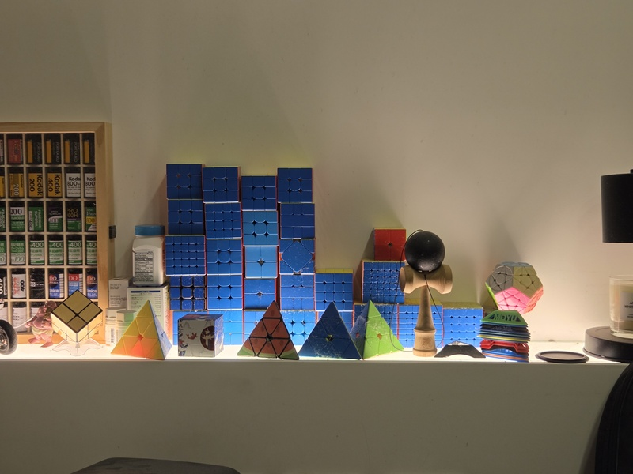

## 啟蒙

小學五年級的時候，班上同學在轉魔術方塊，我很想要學，就問了同學是怎麼轉的，可不可以教我。我不確定當時他是沒聽到還是不理我。我只記得當時心裡有一點不爽，就跑到家附近的書局買了一顆魔術方塊，然後開始上網找資源學，最剛開始我是看 youtube 學會的，但是我找不到當時的影片了，是一個大哥哥戴一個手套布偶，分好幾集教會的，不知道有沒有人看過，如果找到影片拜託跟我說。

我找到幾個小時候看過的影片，都超老的，回憶湧上心頭，五尾現在還是持續深耕魔方界。

* [3x3x3魔術方塊基本解法教學](https://www.youtube.com/watch?v=NUv2ENq2AXA) - BY 小江Tommy
* [魔術方塊教學-基礎中的基礎](https://www.youtube.com/watch?v=GmnOX9iqFZ0) - BY 小丸號五尾

## 第一場比賽

我讀的是台北市光復國小，當時不知道為什麼恰好舉辦了學校第一屆的魔術方塊比賽，這是我人生參加的第一場比賽。印象中完全沒有什麼正式規則，打亂應該也沒有依照正式的轉動代號，就是所有小朋友一起轉就結束了，不過我還是獲得了金牌，是班上一起去的同學最快的。

## 進階

升上國中後，我越轉越快，就開始從 [LBL（layer by layer）](https://1hrbld.tw/3x3-lbl/)更進一步，研究進階的 [CFOP](https://1hrbld.tw/cfop-introduction/) 速解法，我學會了大部分的 PLL、兩段式 OLL、由於不理解所以自己發明的兩段式F2L，當時成績可以穩定 30~40 秒，但是由於社群媒體還不夠發達，所以沒有什麼同好，就只有自得其樂的玩。當時大約 2009 年時我最愛的魔術方塊公式網站，叫做今古庸龍魔方網，網頁大概是長這個樣子[^2]，2025年的現在也已經不存在了。

## 回鍋

大學三年級的某一天在房間，順手拿起了我的舊魔術方塊玩，好奇之下查詢一下過了十年魔術方塊有什麼變革，瞬間排山倒海的資訊，不論是方塊的革新、還有解法的突破、更新好多更順手的公式，讓我驚訝的同時，又重新燃起來熱情，而且過了許多年，教學資源又更豐富了，剛開始回來玩的成績大約跟國中時差不多約 30~40 秒，我開始認真地從頭學習 F2L 技術，並且同時補齊 PLL 和 全部的 57 個 OLL 公式，我很喜歡[鍾以理 Daniel](https://www.youtube.com/@dcube204)的講解，讓我慢慢地融會貫通 F2L，後來我最愛的頻道是 [Jperm](https://www.youtube.com/@JPerm/videos) 的教學，非常的好懂又清楚，非常推薦 [How to be Sub-X](https://www.youtube.com/watch?v=1KfmzTewWyI&list=PLI24ciRbl8BVh6cuX4UMgfbqOTZqb8eNf) 系列，可以按部就班的慢慢突破自己的秒數，~~只是我常常越級看~~。經過一連串的訓練，我漸漸突破到了現在的 15 秒內，並開始試著參加 WCA [比賽](/docs/rubiks_cube/competition)。

## 現在

停滯許久沒玩了，偶爾回鍋一下，玩玩[魔術方塊連解](/blog/2025/12/28/cube)，想再找個時間把盲解練好，再參加比賽把紀錄刷出來，我的心願就滿足了。

**少數有成功的盲解練習紀錄**

<video controls width="320">
    <source src="/video/015.mp4" type="video/mp4" />

    抱歉，您的瀏覽器不支援內嵌影片。
</video>

## 我的魔術方塊們

:::note
，大雁騰雲 v1 是我的最愛主力，沒有之一，[看看我的所有方塊](https://shuojen.site/use)。
:::

## 學習資源

1. [Jperm](https://www.youtube.com/@JPerm/videos)：大學時最喜歡的魔術方塊頻道，我的正階方塊都是從他的頻道學習的，從20幾萬訂閱開始追蹤，可惜2025的現在停更了。
2. [鍾以理 Daniel](https://www.youtube.com/@dcube204)：近期沒有新的魔術方塊影片了，但是以前的也很好看。
3. [Z3Cubing](https://www.youtube.com/@Z3Cubing)：我看的 skewb 斜轉方塊教學。
4. [Cube Master](https://www.youtube.com/@CubeMasterYT)：我看的 SQ-1 異形方塊教學。

[^1]: 學校為了鼓勵小朋友，只依照速度分了金牌、銀牌、銅牌，應該是每個牌位各三人，彼此不分先後，當時我三階的速度大概是55秒左右。
[^2]: 我印象中網頁是藍色的底色，有各種OLL和PLL的公式，而且都可以動畫播放，超級喜歡的。