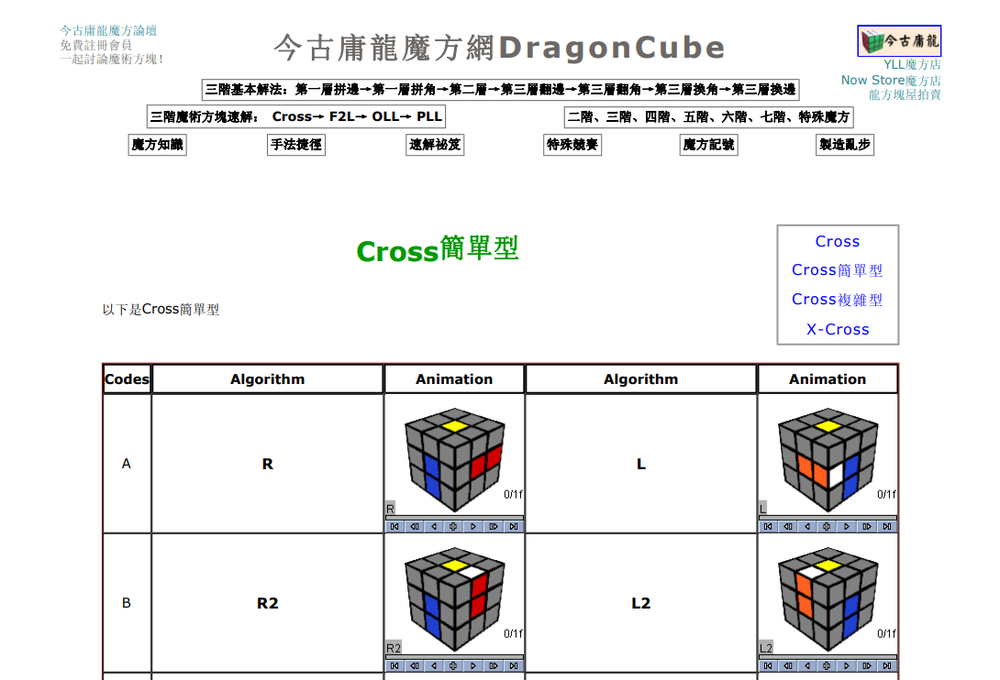

## 啟蒙

小學五年級的時候，班上同學在轉魔術方塊，我很想要學，就問了同學是怎麼轉的，可不可以教我。我不確定當時他是沒聽到還是不理我。我只記得當時心裡有一點不爽，就跑到家附近的書局買了一顆魔術方塊，然後開始上網找資源學，最剛開始我是看youtube學會的，但是我找不到當時的影片了，是一個大哥哥戴一個手套布偶，分好幾集教會的。

## 第一場比賽

我讀的是台北市光復國小，當時不知道為什麼恰好舉辦了學校第一屆的魔術方塊比賽，這是我人生參加的第一場比賽。印象中完全沒有什麼正式規則，打亂應該也沒有依照正式的轉動代號，就是所有小朋友一起轉就結束了，不過我還是獲得了金牌，是班上一起去的同學最快的。

## 進階

升上國中後，我越轉越快，就開始研究進階的解法CFOP解法，大約2009年時我最愛的魔術方塊網站，叫做今古庸龍魔方網，網頁大概是長這個樣子[^2]，2025年的現在也已經不存在了。

## 回鍋

大學的某一天在房間，順手拿起了我的舊魔術方塊玩，好奇之下查詢一下過了十年魔術方塊有什麼變革，瞬間排山倒海的資訊，不論是方塊的革新、還有解法的突破、更新更順手的公式，讓我驚訝的同時，又重新燃起來熱情。

:::note
尚未補充齊全
:::

## 學習資源

1. [Jperm](https://www.youtube.com/@JPerm/videos)：大學時最喜歡的魔術方塊頻道，從20幾萬訂閱開始追蹤，可惜2025的現在停更了。

[^1]: 學校為了鼓勵小朋友，只依照速度分了金牌、銀牌、銅牌，應該是每個牌位各三人，彼此不分先後，當時我三階的速度大概是55秒左右。
[^2]: 我印象中網頁是藍色的底色，有各種OLL和PLL的公式，而且都可以動畫播放，超級喜歡的。