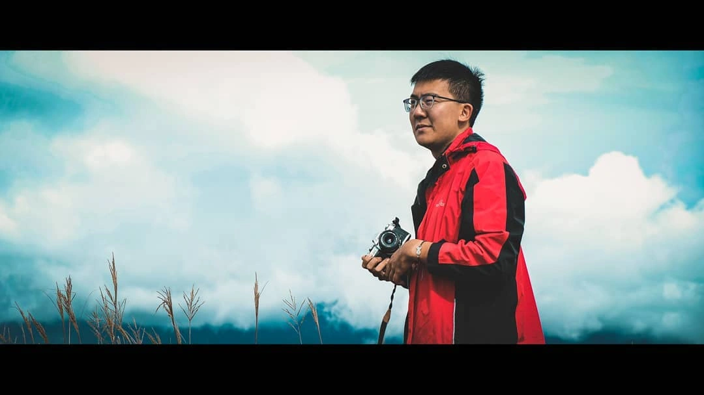
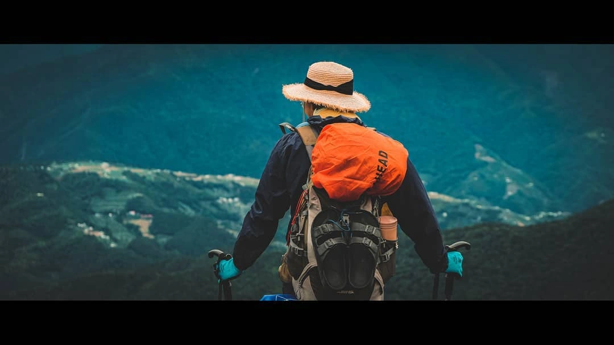
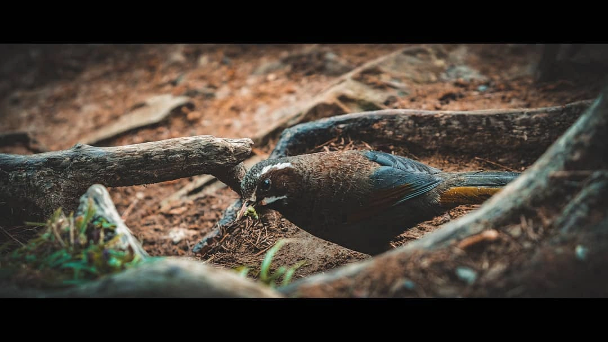
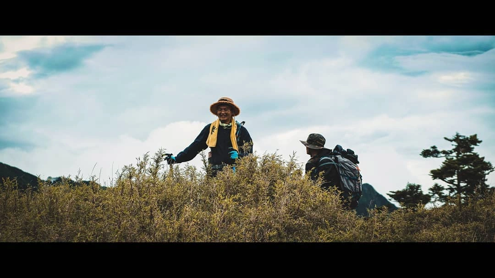
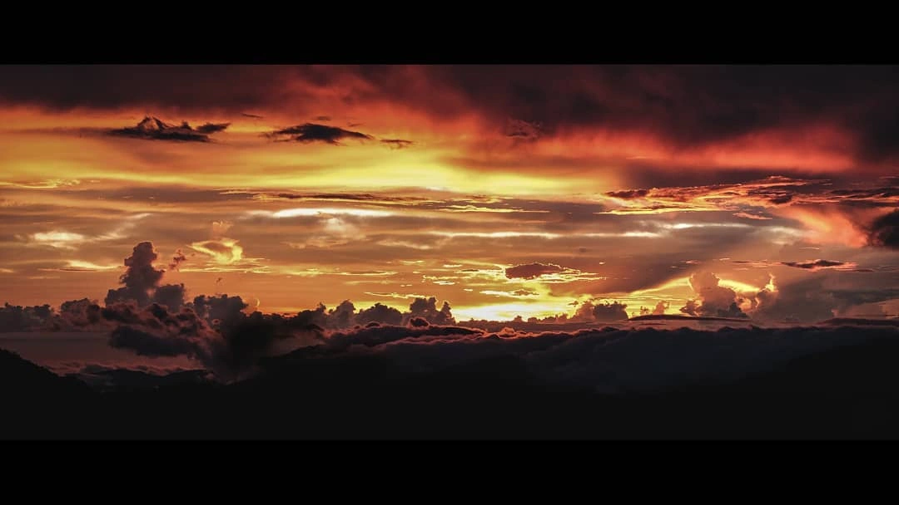

[2020 臺灣雪山 Fujifilm-XT20-4K](https://www.youtube.com/watch?v=5RCsVfIztNE&list=PL0OXdBIpu2-y089dJTpA3LBZACBOaCnBW&index=6)

  <iframe 
    width="320" 
    height="180"
    src="https://www.youtube.com/embed/5RCsVfIztNE?si=cEpATlJVJu_wIXvE"
    title="YouTube video player" 
    frameborder="0" 
    allow="accelerometer; autoplay; clipboard-write; encrypted-media; gyroscope; picture-in-picture; web-share" 
    allowfullscreen>
  </iframe>

:::note 
半夜高山症，後來只爬到雪山東峰，沒到主峰，之後再挑戰一次。
:::