今天入手了一顆經典手動老鏡，Pentax super-takumar 55mm f1.8。

好開心阿，等效 110mm 的長焦人像鏡，拍起來好好玩。

 
 
 
 
 
 
 
 
 
 
 
 
 
 
 
 
 
 
 
 
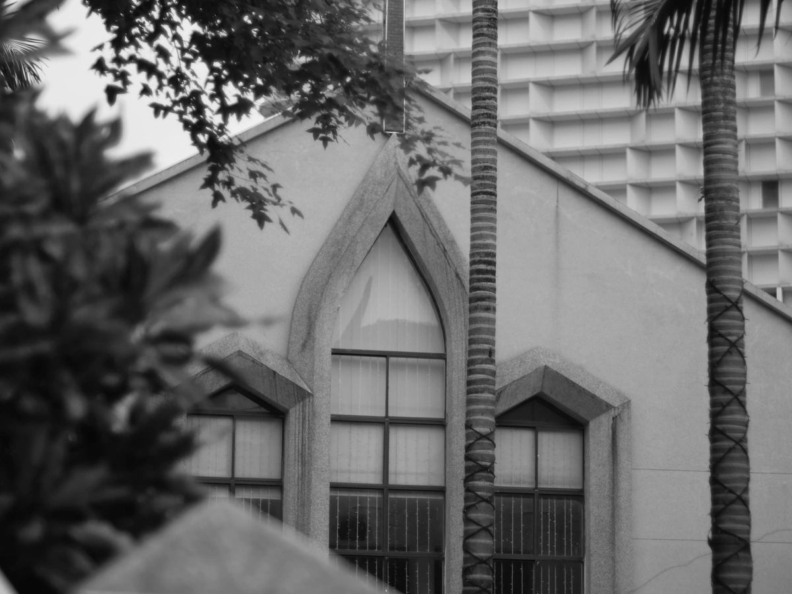 
 
 
 
 
 
 
 
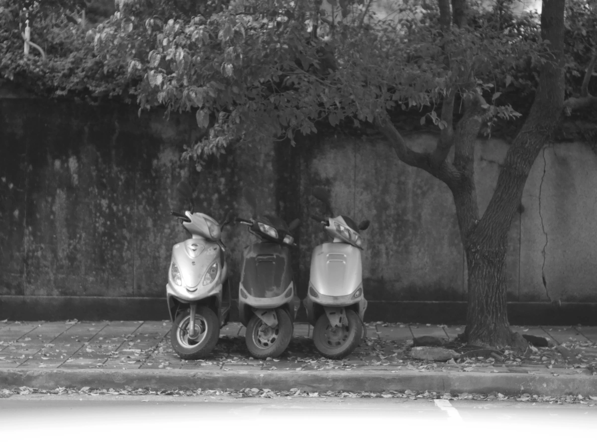 
 
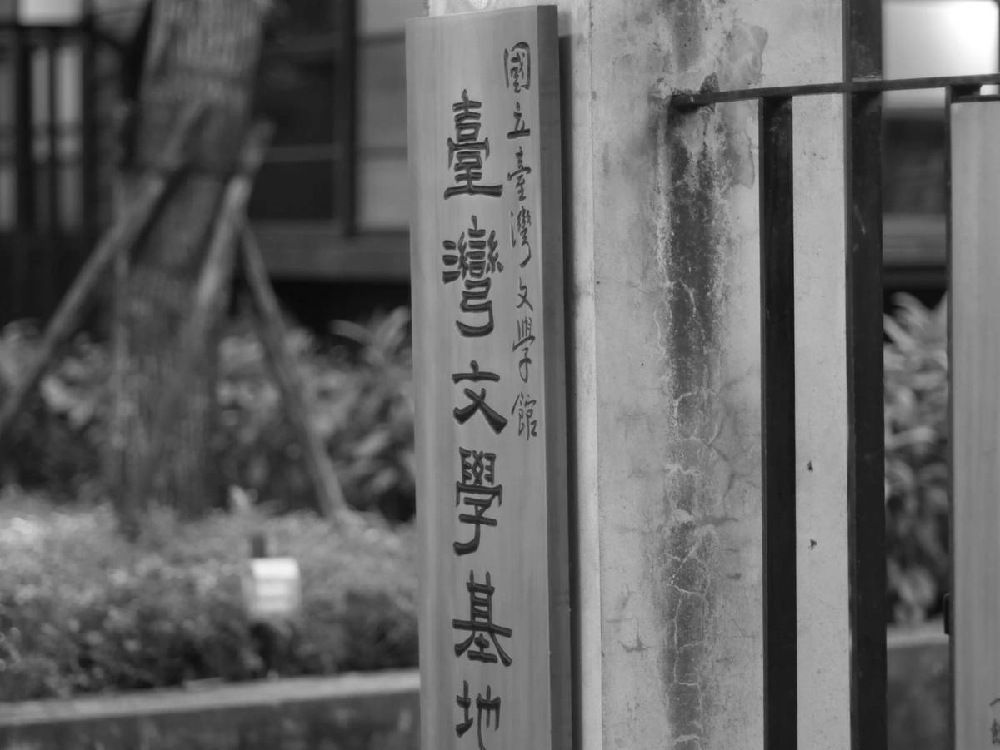 
 
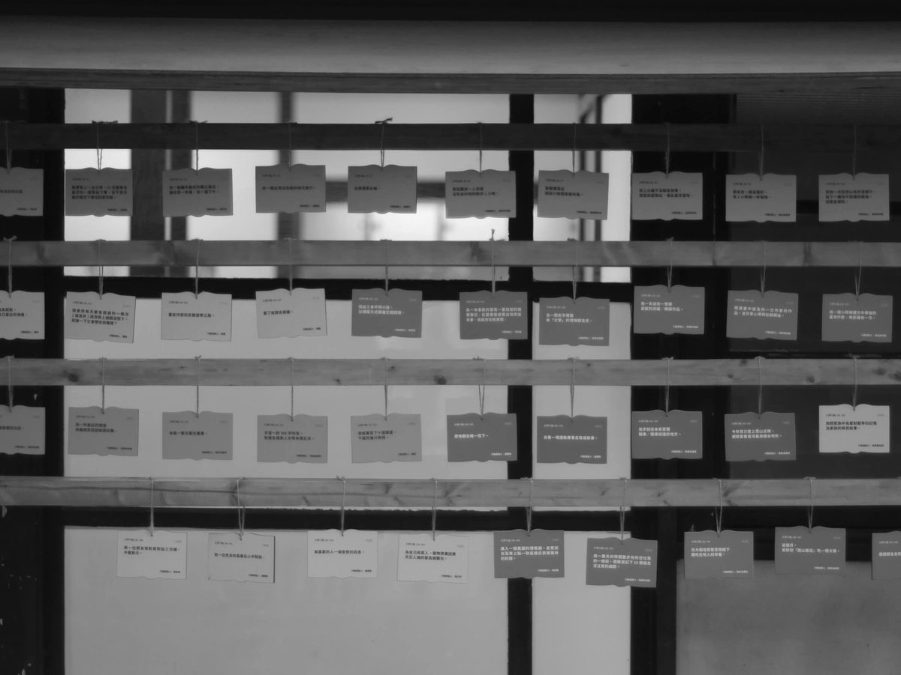 
 
 
 
 
 
 
 
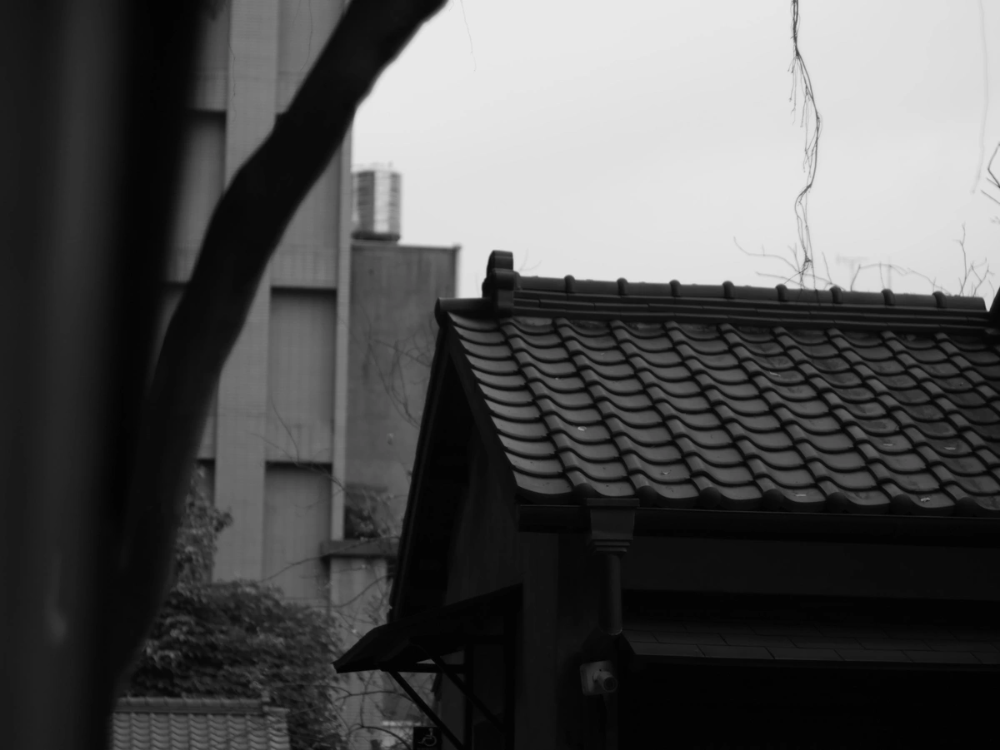 
 
 
 
 
 
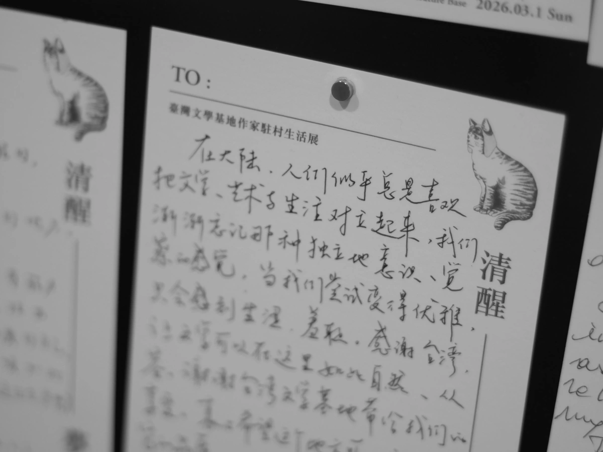 
 
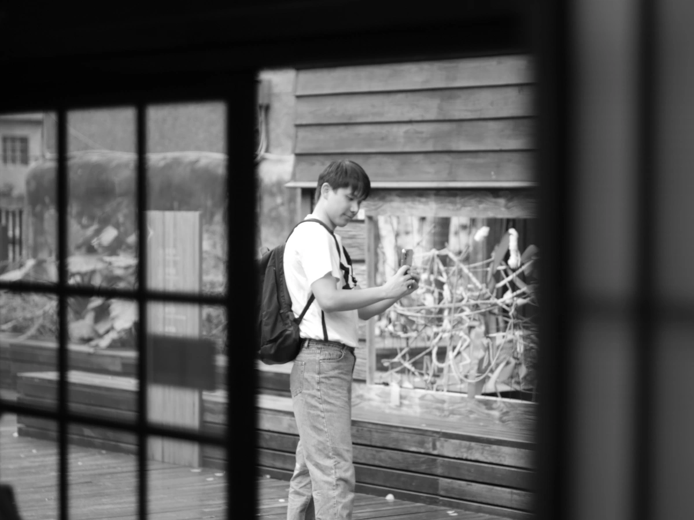 
 
 
 
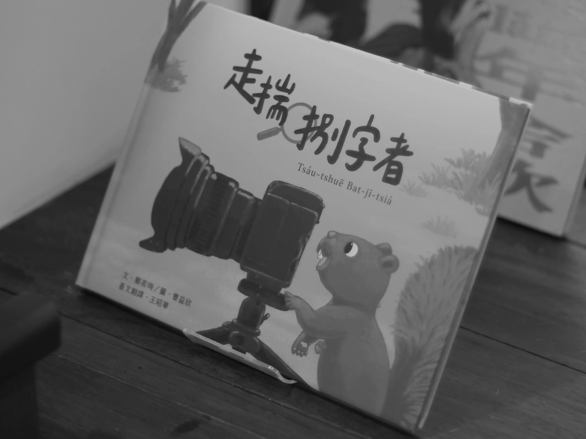 
 
 
 
 
 
 
 
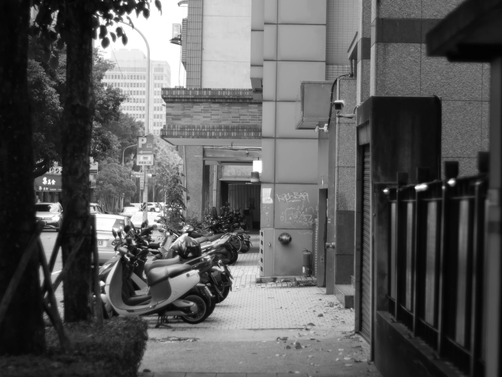 
 
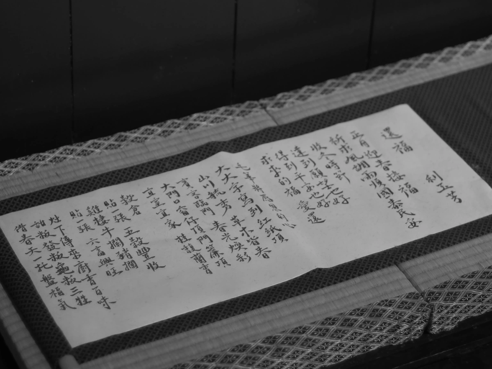 
 
 
 
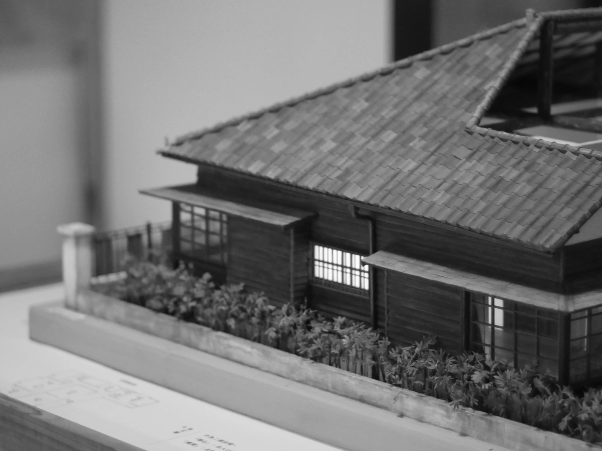 
 
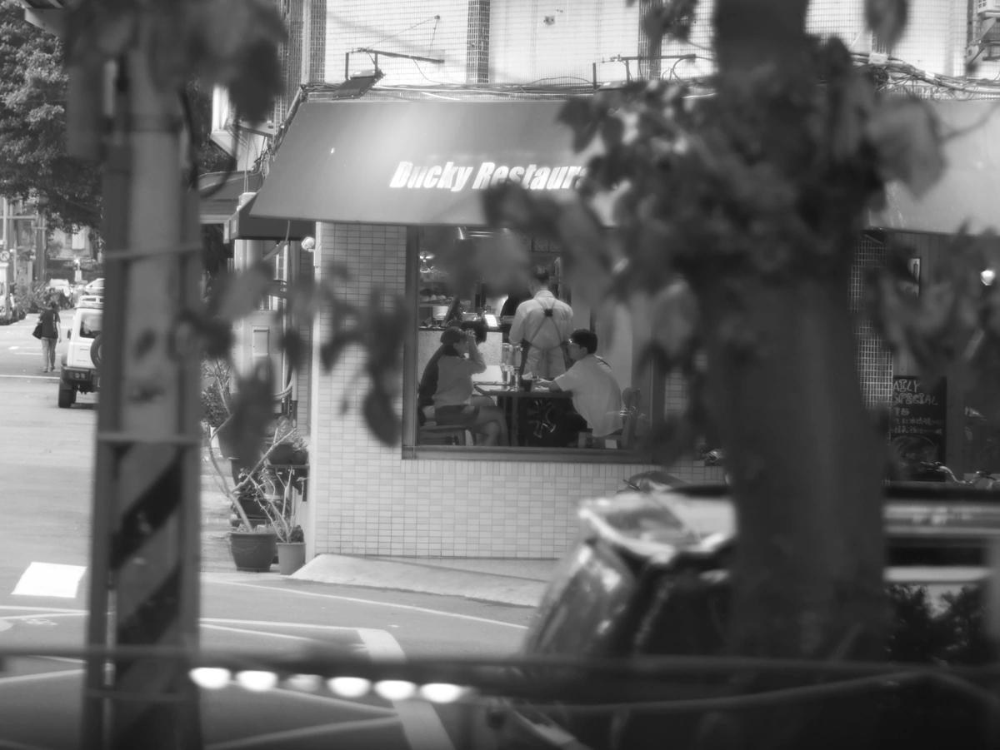 
 
 
 
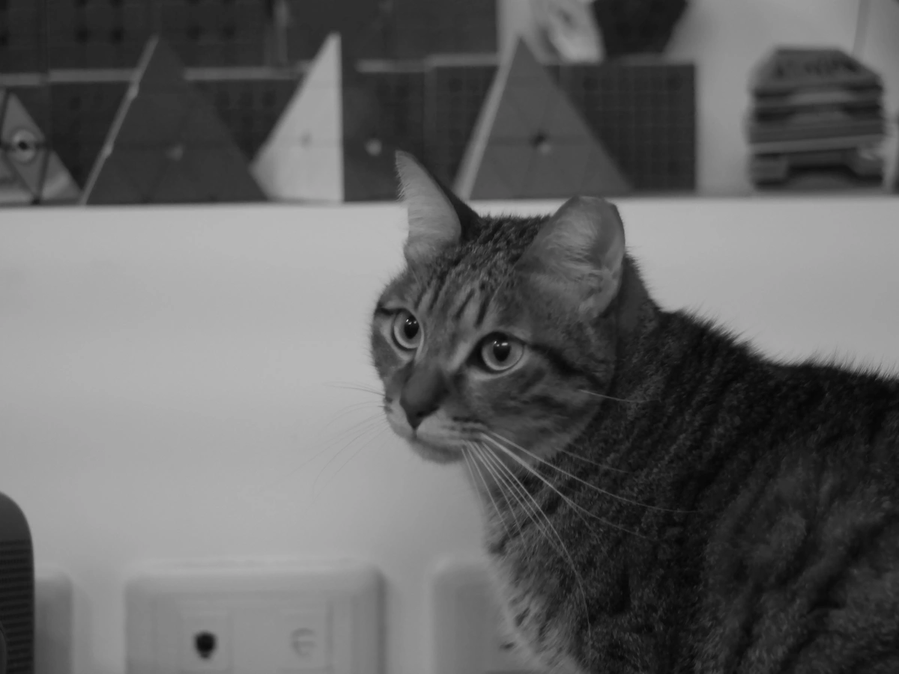 
 

 

 
