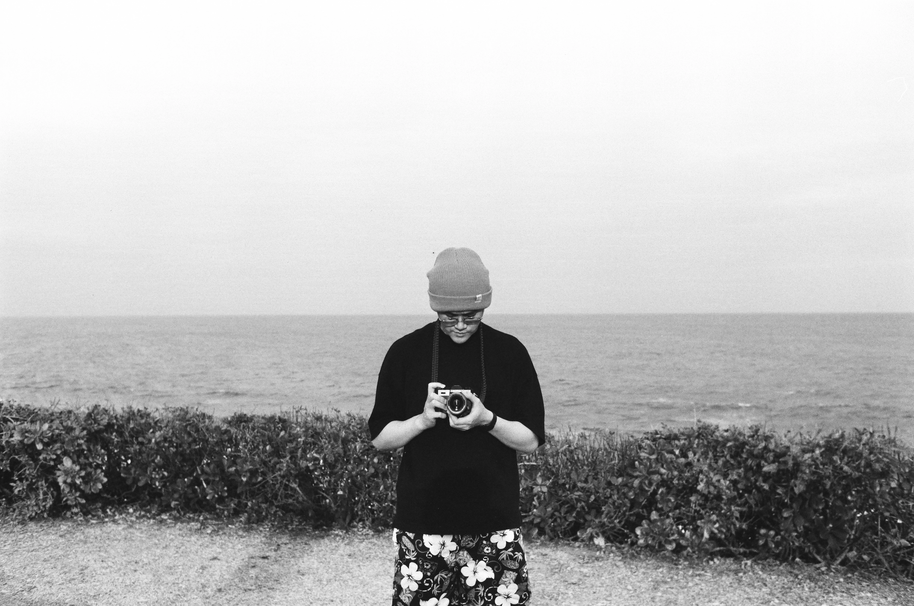

# 黃碩人

>支持越來越多人能夠經營自己的個人網站，直到將所有社群帳號，一個不留的驅逐出這個世界。理想的未來將沒有***商業廣告***、沒有推銷垃圾內容的***演算法***、沒有試圖控制注意力的***中心化企業***，只有每個選擇留下與離開的自由意志。

## 關於我
出生於西元1998年，職業為土木工程師，現居臺北。這裡紀錄我的一些興趣和日常，陸續把以往的點滴統整到這裡後，希望能漸漸脫離主流社群媒體，希望這個地方讓你感到放鬆和有趣，很高興認識你。
