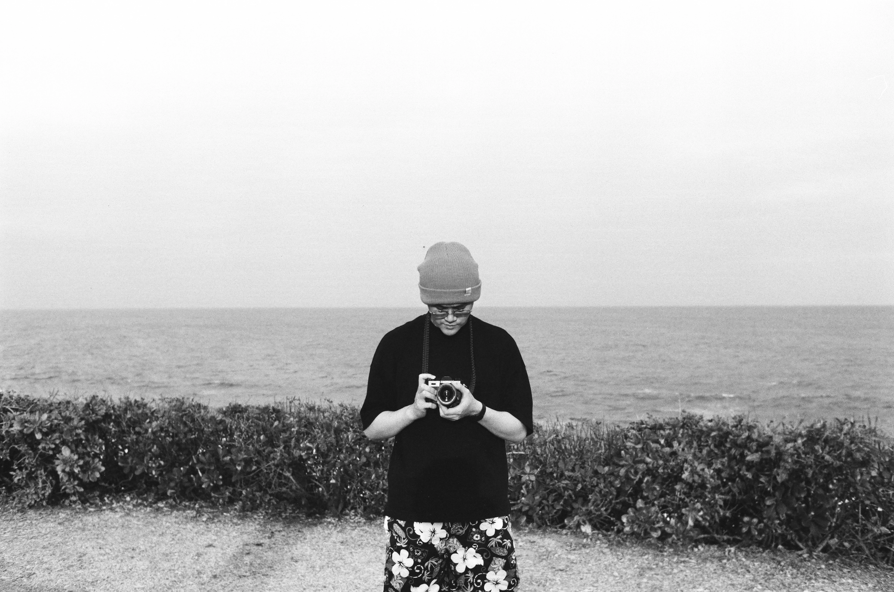

import White from '@site/src/components/White';
import Black from '@site/src/components/Black';
import Marquee from "react-fast-marquee";

<style>{`
  /* Hero 佈局優化 */
  .hero-container {
    display: flex;
    gap: 20px;
    align-items: stretch; /* 讓兩邊高度盡量一致 */
    margin-bottom: 40px;
    flex-wrap: wrap;
  }

  .chess-column {
    flex: 1.5; /* 棋盤佔比稍大 */
    min-width: 350px;
  }

  .about-column {
    flex: 1;
    min-width: 320px;
    max-width: 450px; /* 限制最大寬度，避免右邊太空 */
    background: var(--ifm-color-emphasis-100);
    padding: 30px;
    border-radius: 20px;
    border: 1px solid var(--ifm-color-emphasis-200);
    display: flex;
    flex-direction: column;
    justify-content: center;
  }

  .about-header {
    display: flex;
    align-items: center;
    gap: 25px; /* 照片與文字的間距 */
    margin-bottom: 20px;
  }

  .about-avatar {
    width: 110px; /* 照片改大 */
    height: 110px;
    border-radius: 50%;
    border: 3px solid var(--ifm-color-primary);
    object-fit: cover;
    flex-shrink: 0; /* 防止照片被擠壓 */
  }

  .about-title-group h2 {
    margin: 0 !important;
    font-size: 1.5rem !important;
    border: none !important;
  }

  .info-list {
    list-style: none;
    padding: 0;
    margin: 0;
    font-size: 1rem;
    line-height: 1.8;
  }

  /* 內容卡片樣式保持 */
  .content-grid {
    display: grid;
    grid-template-columns: repeat(auto-fit, minmax(240px, 1fr));
    gap: 20px;
    margin: 20px 0;
  }

  .custom-card {
    background: var(--ifm-card-background-color);
    border: 1px solid var(--ifm-color-emphasis-200);
    border-radius: 16px;
    padding: 24px;
    transition: all 0.3s ease;
    text-decoration: none !important;
    color: inherit !important;
  }

  .custom-card:hover {
    transform: translateY(-5px);
    border-color: var(--ifm-color-primary);
    box-shadow: 0 8px 20px rgba(0,0,0,0.1);
  }

  @media (max-width: 768px) {
    .hero-container { flex-direction: column; }
    .about-column { max-width: 100%; }
    .about-avatar { width: 90px; height: 90px; }
  }

  /* --- 新增：關於我 - 個人檔案卡片樣式 --- */
  .profile-card {
    display: flex;
    background: var(--ifm-card-background-color);
    border: 1px solid var(--ifm-color-emphasis-200);
    border-radius: 24px; /* 比上面的卡片更圓潤一點 */
    overflow: hidden; /* 讓圖片的圓角服貼 */
    box-shadow: var(--ifm-global-shadow-lw); /* 加上輕微的陰影增加層次感 */
    margin-top: 20px;
    transition: border-color 0.3s ease;
  }

  .profile-card:hover {
     border-color: var(--ifm-color-primary);
  }

  .profile-image-container {
    flex: 2; /* 圖片佔據約 40% 寬度 */
    min-height: 300px;
    position: relative;
  }

  /* 讓 MDX 的圖片填滿容器 */
  .profile-image-container img {
    width: 100%;
    height: 100%;
    object-fit: cover; /* 保持比例填滿，多餘裁切 */
    display: block;
  }

  .profile-content-container {
    flex: 3; /* 文字佔據約 60% 寬度 */
    padding: 40px;
    display: flex;
    flex-direction: column;
    justify-content: center;
  }

  .profile-name {
    margin-top: 0;
    margin-bottom: 24px;
    color: var(--ifm-color-primary);
    font-size: 2rem;
    font-weight: bold;
  }

  /* 美化列表樣式 */
  .profile-details-list {
    list-style: none;
    padding: 0;
    margin: 0;
    font-size: 1.1rem;
    line-height: 2;
  }

  .profile-details-list li {
    display: flex;
    align-items: center;
    gap: 12px;
  }

  .profile-icon {
    font-size: 1.3rem;
    opacity: 0.8;
  }

  /* 手機版響應式調整 */
  @media (max-width: 768px) {
    .profile-card {
      flex-direction: column;
    }
    .profile-image-container {
      min-height: 250px;
      flex: auto;
    }
    .profile-content-container {
        padding: 30px 24px;
    }
  }
`}</style>

# 🏠 /ᐠ .ᆺ. ᐟ\ﾉ

這裡是我記錄生活和興趣的地方，我支持每個人都架設自己的網站，讓社群媒體不再受格式、軟體的限制，享受沒有**商業廣告**、沒有**演算法**、沒有**登入限制**的自由，希望這個地方讓你感到有趣，很高興認識你。

<Marquee gradient={false} speed={60}>
  <div style={{padding: '10px 0', fontSize: '1.1rem'}}>
    我直接在家門口放一個我最愛的西洋棋開局：四♞蘇格蘭，沒有為什麼，因為個人網頁很***自由***！
  </div>
</Marquee>
<White pgn="1. e4 e5 2. Nf3 Nc6 3. Nc3 Nf6 3. d4" />

# 主要內容

<div className="content-grid">
  <a href="/docs/intro" className="custom-card">
    <div className="card-icon">🧩</div>
    <h3 style={{margin: 0, color: 'var(--ifm-color-primary)'}}>興趣分享</h3>
    <p style={{marginTop: '10px', fontSize: '0.95rem', opacity: 0.8}}>常駐的興趣分享區塊，包含西洋棋、魔術方塊等。電影選片請看：**電影推薦清單**。</p>
  </a>

  <a href="/blog" className="custom-card">
    <div className="card-icon">✍️</div>
    <h3 style={{margin: 0, color: 'var(--ifm-color-primary)'}}>貼文紀錄</h3>
    <p style={{marginTop: '10px', fontSize: '0.95rem', opacity: 0.8}}>部落格式的不定時紀錄， 2025 以前的內容是從社群媒體搬運過來的。</p>
  </a>

  <a href="/photography" className="custom-card">
    <div className="card-icon">📷</div>
    <h3 style={{margin: 0, color: 'var(--ifm-color-primary)'}}>攝影作品</h3>
    <p style={{marginTop: '10px', fontSize: '0.95rem', opacity: 0.8}}>偶爾出遊時心血來潮拍攝的作品紀錄，2019 年從底片相機開始入攝影坑。</p>
  </a>
</div>

歡迎在下方使用 RSS 連結訂閱我的文章（ [那是什麼？](/blog/2025/09/16/rss#%E8%AA%8D%E8%AD%98-rss)）

Blog 貼文 RSS：

```
https://shuojen.com/blog/rss.xml
```

攝影作品 RSS：

```
https://shuojen.com/photoblog/rss.xml
```

# 即時數據
貼文區目前共有 **[POST_COUNT]** 篇文章，共累積了 **[WORD_COUNT]** 個字。

# 其他頁面
* [我在用什麼`/use`](/use)
* [我在做什麼`/now`](/now)
* [貼文列表`/blog/archive`](/blog/archive)
* [攝影列表`/photoblog/photo-archive`](/photoblog/photo-archive)

# 關於我
黃碩人，出生於西元 1998 年，現居臺北，土木工程師，女朋友綽號是蝦波。



# 聯絡我
歡迎到[留言板](/guestbook)逛逛，有任何想法，也可以聯絡我的信箱。
>me@shuojen.site


